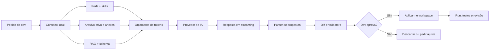
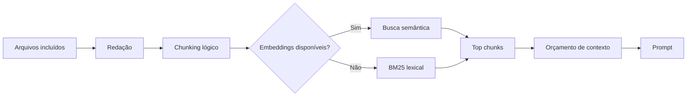
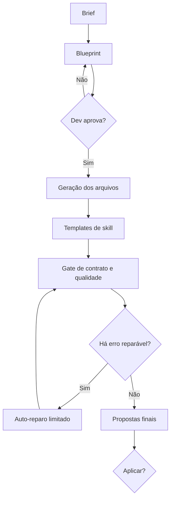
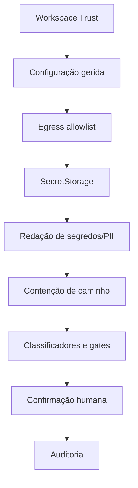
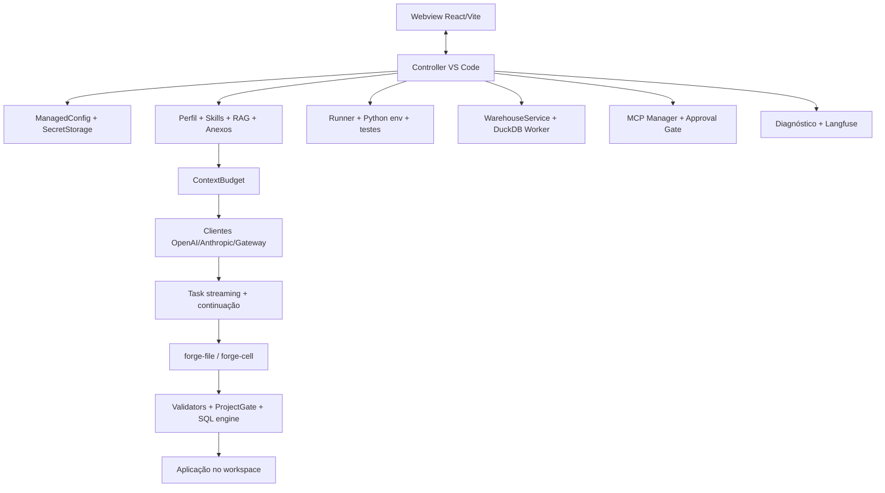

<div align="center">

# FORGE

## Codegen Claro para engenharia de software, dados e IA

**Um ambiente de desenvolvimento assistido por IA dentro do VS Code, com contexto do projeto, skills
especializadas, propostas revisáveis, execução governada, quality gates, SQL profissional e operação
in-network.**

Versão **2.15.0** · VS Code **1.93+** · Windows x64 · Licença Apache-2.0 ·
[GitHub](https://github.com/sergiogaiotto/forge)

</div>

---

> **Este README é o livro do FORGE.** Ele começa do zero, explica os conceitos sem pressupor experiência
> com IA e chega até arquitetura, segurança, administração e desenvolvimento da própria extensão.
> Para uma consulta rápida, use o [mapa de leitura](#mapa-de-leitura). Para operação corporativa,
> complemente com o [Guia do Administrador](docs/GUIA-DO-ADMIN.md).

## Mapa de leitura

| Você quer… | Comece aqui |
|---|---|
| Instalar e fazer a primeira geração | [Parte I — Primeiros passos](#parte-i-primeiros-passos) |
| Copiar exemplos de dashboard, landing page, SQL, Spark e ML | [Laboratório de hello worlds](#51-laboratório-de-hello-worlds) |
| Entender como escrever bons pedidos | [Capítulo 6 — Como pedir](#6-como-pedir-prompts-que-produzem-código-melhor) |
| Entender `Output: 128K`, contexto e código cortado | [Capítulo 7 — Contexto, tokens e completude](#7-janela-de-contexto-tokens-e-completude) |
| Preparar Python, `.venv` e testes | [Capítulo 13 — Python e execução](#13-python-venv-execução-e-testes) |
| Trabalhar com Jupyter, pandas ou Polars | [Capítulo 14 — Ciência de dados](#14-ciência-de-dados-e-jupyter-notebook) |
| Trabalhar com Spark SQL, DataFrames ou RDD | [Capítulo 15 — Spark](#15-spark-connect-spark-sql-dataframes-e-rdd) |
| Criar dashboards com identidade Claro | [Capítulo 16 — Dashboards](#16-dashboards-analíticos-com-identidade-claro) |
| Criar, executar ou tunar SQL | [Capítulo 17 — SQL, warehouse e dbt](#17-sql-warehouse-dbt-e-cockpit-de-tuning) |
| Entender RAG, `@arquivo` e upload | [Capítulos 6 e 11](#11-rag-o-forge-conhece-o-seu-código) |
| Entender segurança, LGPD e egress | [Capítulo 18 — Segurança](#18-segurança-privacidade-e-governança) |
| Ver todos os comandos | [Capítulos 23 e 24](#23-referência-dos-39-comandos-do-chat) |
| Ver todos os settings | [Capítulo 25 — Configurações](#25-referência-das-64-configurações) |
| Desenvolver e empacotar o FORGE | [Capítulo 27 — Arquitetura e desenvolvimento](#27-arquitetura-interna-build-testes-e-empacotamento) |
| Resolver um problema | [Capítulo 28 — Solução de problemas](#28-solução-de-problemas-e-pegadinhas) |

## Índice geral

### Guia de entrada

1. [O que é o FORGE](#1-o-que-é-o-forge)
2. [O modelo mental em uma página](#2-o-modelo-mental-em-uma-página)
3. [Instalação, atualização e remoção](#3-instalação-atualização-e-remoção)
4. [Licença, provedor e chave de API](#4-licença-provedor-e-chave-de-api)
5. [Primeiros 10 minutos](#5-primeiros-10-minutos)

### Guia de colaboração com IA

6. [Como pedir: prompts que produzem código melhor](#6-como-pedir-prompts-que-produzem-código-melhor)
7. [Janela de contexto, tokens e completude](#7-janela-de-contexto-tokens-e-completude)
8. [Propostas, diff, aplicar e continuar](#8-propostas-diff-aplicar-e-continuar)
9. [Skills: conhecimento especializado](#9-skills-conhecimento-especializado)
10. [Perfil do projeto e convenções duráveis](#10-perfil-do-projeto-e-convenções-duráveis)
11. [RAG: o FORGE conhece o seu código](#11-rag-o-forge-conhece-o-seu-código)
12. [Modo Projeto e quality gates](#12-modo-projeto-e-quality-gates)

### Guia por especialidade

13. [Python, `.venv`, execução e testes](#13-python-venv-execução-e-testes)
14. [Ciência de dados e Jupyter Notebook](#14-ciência-de-dados-e-jupyter-notebook)
15. [Spark Connect, Spark SQL, DataFrames e RDD](#15-spark-connect-spark-sql-dataframes-e-rdd)
16. [Dashboards analíticos com identidade Claro](#16-dashboards-analíticos-com-identidade-claro)
17. [SQL, warehouse, dbt e cockpit de tuning](#17-sql-warehouse-dbt-e-cockpit-de-tuning)

### Guia de operação

18. [Segurança, privacidade e governança](#18-segurança-privacidade-e-governança)
19. [FinOps, observabilidade e diagnóstico](#19-finops-observabilidade-e-diagnóstico)
20. [MCP e busca interna](#20-mcp-ferramentas-e-busca-interna)
21. [Git, OCR, revisão e CI/CD](#21-git-ocr-revisão-e-cicd)
22. [Trilhas por perfil](#22-trilhas-recomendadas-por-perfil)

### Referência e receitas

23. [Os 39 comandos do chat](#23-referência-dos-39-comandos-do-chat)
24. [Os 32 comandos do VS Code](#24-referência-dos-32-comandos-do-vs-code)
25. [As 64 configurações](#25-referência-das-64-configurações)
26. [Livro de receitas](#26-livro-de-receitas)
27. [Arquitetura, build, testes e pacote](#27-arquitetura-interna-build-testes-e-empacotamento)
28. [Solução de problemas e pegadinhas](#28-solução-de-problemas-e-pegadinhas)
29. [Glossário](#29-glossário)
30. [Documentação complementar](#30-documentação-complementar)

---

# Parte I — Primeiros passos

## 1. O que é o FORGE

O FORGE é uma extensão do VS Code para geração e manutenção de código com IA. Você descreve uma
tarefa, fornece o contexto relevante e recebe uma ou mais **propostas de arquivo**. Cada proposta pode
ser examinada em diff, validada e aplicada. A IA não precisa escrever diretamente no workspace.

O produto foi desenhado para equipes de software, dados, machine learning e inteligência artificial
que precisam equilibrar velocidade com controle. Ele combina seis capacidades:

1. **Geração assistida:** cria ou altera código, testes, documentação, notebooks e SQL.
2. **Grounding:** usa o arquivo ativo, anexos, RAG, perfil, skills e schemas reais.
3. **Propostas revisáveis:** separa “o modelo sugeriu” de “o projeto foi alterado”.
4. **Validação local:** executa verificações compatíveis com a stack e com o modo de trabalho.
5. **Governança:** confirma ações sensíveis, limita SQL, controla egress e registra decisões.
6. **Operação soberana:** suporta modelos e embeddings in-network, com internet pública bloqueada por
   padrão.

### 1.1 O que ele não é

Entender os limites evita expectativas erradas:

- Não é um substituto para revisão humana, testes de negócio ou aprovação arquitetural.
- Não é um banco de dados. O DuckDB local é um laboratório; Oracle, PostgreSQL e BigQuery continuam
  sendo sistemas externos e autoritativos.
- Não é uma garantia de que uma reescrita SQL é semanticamente equivalente. O FORGE ajuda a validar e
  comparar evidências, mas a regra de negócio ainda precisa ser provada.
- Não envia automaticamente cada arquivo do repositório ao modelo. O contexto é selecionado e orçado.
- Não embute todos os runtimes possíveis. Python, Jupyter, Spark e CLIs externos têm pré-requisitos
  descritos neste livro.
- Não transforma um teto de 128K tokens de saída em uma promessa de que o provedor produzirá 128K
  tokens úteis numa única resposta.

### 1.2 Os sete fundamentos

**Governança determinística.** Regras críticas são código local, não sugestões no prompt. Um
classificador SQL, por exemplo, decide se há leitura, escrita ou operação destrutiva antes da execução.

**Grounding.** A qualidade aumenta quando o modelo recebe fatos do projeto: contratos existentes,
schema, dependências, padrões e trechos relacionados.

**Progressive disclosure.** O FORGE não injeta o conteúdo integral de todas as skills e de todo o
repositório em todas as chamadas. Primeiro descobre o que é relevante; depois carrega os detalhes.

**Human in the loop.** O dev revisa diff e confirma ações sensíveis. Automação não significa ausência
de responsabilidade.

**Deny by default.** A internet pública começa bloqueada. Os destinos precisam ser autorizados.

**Fail safely.** Quando uma ferramenta opcional não existe, o produto informa a limitação e evita
inventar uma validação que não ocorreu. Algumas checagens são consultivas por desenho.

**Evidência antes de confiança.** Testes, typecheck, planos SQL, métricas observadas, hashes e logs têm
mais peso que uma frase otimista do modelo.

## 2. O modelo mental em uma página

Uma geração normal percorre este fluxo:



Há três planos que não devem ser confundidos:

| Plano | Pergunta | Exemplo |
|---|---|---|
| **Intenção** | O que o dev quer? | “Crie um dashboard de churn.” |
| **Contexto** | Quais fatos o modelo recebe? | `@churn.csv`, componentes existentes, skill Claro. |
| **Evidência** | Como sabemos que ficou bom? | Build, testes, screenshot, métricas e revisão. |

Um prompt excelente com contexto ruim ainda produz suposições. Contexto excelente sem validação ainda
pode produzir bug. O FORGE existe para ligar as três camadas.

## 3. Instalação, atualização e remoção

### 3.1 Pré-requisitos

Para o uso básico:

- VS Code `1.93.0` ou mais novo.
- Um workspace aberto e confiável.
- Um arquivo `.vsix` compatível com a plataforma.
- Uma licença válida e um provedor acessível.

Recursos opcionais podem exigir:

- Git para status, diff, log, commit e revisão.
- Python para `.venv`, execução, pytest e Jupyter.
- Extensões Python/Jupyter do VS Code para a experiência de notebook.
- Tesseract para OCR de screenshots.
- SQLcl/sqlplus, `psql`, `bq`, AWS CLI ou OCI CLI para serviços externos.
- Java/Spark/PySpark para Spark clássico.

### 3.2 Instalar pela interface

1. Abra **Extensions** com `Ctrl+Shift+X`.
2. Abra o menu `...`.
3. Escolha **Install from VSIX...**.
4. Selecione `forge-win32-x64-2.15.0.vsix`.
5. Recarregue a janela.
6. Confirme o ícone FORGE na barra lateral.

### 3.3 Instalar pelo terminal

```powershell
code --install-extension .\forge-win32-x64-2.15.0.vsix --force
```

O `--force` é útil ao substituir uma instalação da mesma versão durante testes.

### 3.4 Verificar a integridade

Compare o SHA-256 recebido por um canal confiável:

```powershell
Get-FileHash .\forge-win32-x64-2.15.0.vsix -Algorithm SHA256
```

O hash confirma os bytes; ele não substitui uma assinatura de distribuição. O admin também pode usar
os comandos de assinatura e verificação do `admin-cli`.

### 3.5 Atualizar

Instale o VSIX mais novo com `--force` e recarregue o VS Code. Configurações, licença e credenciais
armazenadas no SecretStorage são separadas do pacote, mas sempre confira o changelog quando uma versão
altera schemas de configuração.

### 3.6 Remover ou sair

- **FORGE: Sair** limpa licença, sessão e credenciais do FORGE.
- Desinstalar a extensão remove o código da extensão, mas não é equivalente a apagar arquivos que ela
  criou no workspace, como `.forge/project.md`.
- Para remover a extensão por terminal:

```powershell
code --uninstall-extension claro-data-platform.forge
```

## 4. Licença, provedor e chave de API

### 4.1 Licença local e licença via gateway

As licenças são assinadas com Ed25519. A chave pública verifica a assinatura; a chave privada fica com
o emissor.

| Modo | Setting | Uso |
|---|---|---|
| `local` | `forge.license.mode = "local"` | Desenvolvimento, PoC ou ambiente isolado. Verificação no cliente. |
| `gateway` | `forge.license.mode = "gateway"` | Produção corporativa, revogação e orçamento autoritativos. |

O modo local permite operação offline, mas não é uma fronteira corporativa inviolável. Quando o
controle precisa ser autoritativo, o gateway deve recusar inferência sem licença válida.

### 4.2 Provedores

O onboarding e **FORGE: Configurar provedor** suportam:

- HubGPU Claro, por endpoint OpenAI-compatible.
- OpenAI.
- Anthropic.
- Outros endpoints OpenAI-compatible configurados explicitamente.

Os presets internos incluem `openai/gpt-oss-120b` e `openai/gpt-oss-20b`.

### 4.3 Onde informar a API key

Use a tela de configuração do provedor. O valor digitado é enviado ao **SecretStorage** do VS Code,
que usa o cofre do sistema operacional. O `settings.json` guarda parâmetros não secretos, nunca a chave.

Não coloque a chave em:

- `README.md`;
- `.vscode/settings.json`;
- `.env` versionado;
- prompt do chat;
- parâmetro de linha de comando registrado em histórico;
- `forge.egress.allowedHosts`.

### 4.4 OpenAI externa e o erro de egress

Por padrão, `https://api.openai.com` é bloqueado. Para um ambiente pessoal autorizado:

```jsonc
{
  "forge.egress.allowExternal": true,
  "forge.egress.allowedHosts": [
    "api.openai.com"
  ]
}
```

Depois, abra **FORGE: Configurar provedor**, escolha OpenAI e informe a chave no campo próprio.

> **Pegadinha:** `allowedHosts` recebe o host, como `api.openai.com`, não a URL completa
> `https://api.openai.com/v1`.

Em ambiente corporativo, prefira um gateway interno e mantenha `allowExternal:false`.

### 4.5 Testar sem confundir os diagnósticos

Uma falha pode acontecer em camadas diferentes:

| Mensagem | Camada provável |
|---|---|
| `Egress bloqueado por política` | Host não permitido pelo FORGE |
| `401` ou `403` | Credencial ou autorização do provedor |
| `404` | Base URL, rota ou model ID incorretos |
| `400 max tokens/context` | Janela servida menor que a solicitada |
| Timeout | Modelo, rede ou esforço de raciocínio demorou além do limite |

## 5. Primeiros 10 minutos

### Minuto 1: abra uma pasta

O FORGE precisa de um workspace para RAG, perfil, propostas, execução e segurança de caminho.

### Minuto 2: ative e configure

1. Execute **FORGE: Ativar licença**.
2. Execute **FORGE: Configurar provedor**.
3. Use o teste de conexão.

### Minuto 3: conheça o arquivo ativo

Abra um arquivo pequeno e pergunte:

> Explique a responsabilidade deste arquivo, os riscos principais e uma melhoria pequena. Não altere nada.

Esse pedido separa análise de edição e ajuda a conferir se o contexto está correto.

### Minuto 5: gere uma alteração estreita

> Adicione validação para entrada vazia nesta função. Preserve a API pública e inclua um teste de regressão.

Revise o cartão, abra o diff e confira:

- caminho;
- imports;
- assinatura pública;
- casos de erro;
- teste;
- resultado do validator.

### Minuto 7: aplique e teste

Clique em **Aplicar e abrir**. Depois use `/testes` ou o comando de teste apropriado.

### Minuto 9: veja o contexto real

Use:

```text
/contexto
/indice
```

O primeiro mostra orçamento; o segundo mostra skills e arquivos indexados.

### Minuto 10: grave uma regra durável

Abra `/perfil` e registre uma convenção real:

```markdown
## Regras

- Preserve APIs públicas salvo pedido explícito.
- Toda correção de bug deve incluir teste de regressão.
- Nunca inclua segredos, credenciais ou dados pessoais em fixtures.
```

### 5.1 Laboratório de hello worlds

Os exemplos a seguir são pequenos projetos completos, não apenas frases soltas. Troque os caminhos
`@...` pelos arquivos do seu workspace, mantenha somente os requisitos que fazem sentido e envie o
bloco inteiro ao chat. O FORGE poderá combinar o arquivo ativo, referências `@`, RAG, perfil e skills
especializadas para produzir uma proposta revisável.

> **Regra de ouro:** um hello world profissional termina com evidência. Peça sempre arquivos
> esperados, validação, testes e instruções de execução. Para dados e machine learning, métricas
> inexistentes devem aparecer como indisponíveis, nunca como números inventados.

| Quero experimentar | Prepare primeiro | Exemplo |
|---|---|---|
| Dashboard executivo Claro | CSV/XLSX no workspace | [1](#hello-world-1-dashboard-claro-a-partir-de-dados-reais) |
| Landing page responsiva | Briefing e imagens locais | [2](#hello-world-2-landing-page-de-produto) |
| SQL local e offline | CSV, Parquet ou JSON | [3](#hello-world-3-sql-local-com-duckdb) |
| Super query de warehouse | Conexão e schema indexado | [4](#hello-world-4-super-query-e-tuning-no-banco-real) |
| EDA em Jupyter | Dataset no workspace | [5](#hello-world-5-eda-documentada-em-jupyter) |
| Pipeline pandas/Polars | Arquivo de entrada e contrato | [6](#hello-world-6-pipeline-defensivo-com-pandas-ou-polars) |
| PySpark sem JVM local | Endpoint Spark Connect | [7](#hello-world-7-pyspark-com-spark-connect) |
| Spark SQL e RDD clássico | Java e Spark clássico | [8](#hello-world-8-spark-sql-e-rdd-clássico) |
| Modelo de machine learning | Dataset rotulado | [9](#hello-world-9-modelo-de-machine-learning-reproduzível) |
| Serviço de inferência | Artefato de modelo | [10](#hello-world-10-modelo-em-produção-com-api-e-mlops) |
| API hexagonal | Regras do domínio | [11](#hello-world-11-api-python-hexagonal) |
| Projeto dbt | `manifest.json` ou projeto dbt | [12](#hello-world-12-mart-analítico-com-dbt) |
| Pipeline Airflow | Fonte, destino e SLA | [13](#hello-world-13-pipeline-airflow-operável) |
| Contrato de qualidade | Schema e regras de negócio | [14](#hello-world-14-contrato-de-dados-e-quality-gate) |
| Migração com paridade | Implementação antiga e nova | [15](#hello-world-15-migração-com-prova-de-paridade) |
| Bug a partir de screenshot | Imagem e arquivo relacionado | [16](#hello-world-16-correção-guiada-por-screenshot) |

#### Hello world 1: dashboard Claro a partir de dados reais

Coloque, por exemplo, `vendas.csv` em `data/` e use `@data/vendas.csv`. Para XLSX, prefira manter o
arquivo dentro do workspace: anexos genéricos podem ser extraídos como texto, enquanto `@arquivo`
torna a origem explícita e reutilizável.

```text
/projeto

Crie um dashboard executivo responsivo com identidade visual Claro Brasil usando
@data/vendas.csv como única fonte de verdade.

Objetivos:
- KPIs: receita, pedidos, ticket médio, conversão e variação contra o período anterior;
- filtros reais por período, UF, canal e produto;
- tiles executivos, linha temporal, barras por UF, composição por canal, gauge de meta,
  box plot de ticket e tabela detalhada pesquisável;
- estados de carregamento, vazio, erro e dado indisponível;
- acessibilidade por teclado, contraste adequado e layout mobile;
- formatação brasileira de moeda, número e data.

Antes de codificar, inspecione schema, tipos, nulos, cardinalidade e período coberto. Não invente
metas, dimensões ou métricas ausentes. Quando uma visualização não for suportada pelos dados,
explique e substitua por uma alternativa honesta.

Preserve o framework e as bibliotecas existentes. Use a skill claro-dashboard-ui, implemente,
rode build e testes e informe os arquivos alterados e como abrir o dashboard.
```

**Resultado esperado:** uma experiência analítica, não uma tabela enfeitada. A proposta deve conter
componentes, transformação dos dados, gráficos ligados aos filtros, responsividade e validação.
Consulte o [capítulo de dashboards](#16-dashboards-analíticos-com-identidade-claro) para critérios
visuais e analíticos completos.

#### Hello world 2: landing page de produto

Prepare um briefing, uma imagem real do produto e, quando existir, tokens de design. Um bom hero
mostra o produto na primeira dobra e deixa visível o início da seção seguinte.

```text
/projeto

Crie uma landing page para o produto "Claro Casa Conectada".

Use @docs/briefing-casa-conectada.md para conteúdo e @public/casa-conectada.jpg como imagem
principal. Preserve a stack atual e não adicione CDN.

A página deve ter:
- hero imersivo com o nome literal do produto, imagem real e CTA "Conheça os planos";
- benefícios verificáveis derivados do briefing;
- comparação de planos, cobertura, perguntas frequentes e CTA final;
- formulário acessível com nome, telefone, CEP, consentimento LGPD e validação;
- navegação por teclado, foco visível, labels reais e mensagens de erro úteis;
- responsividade em 360, 768 e 1440 px;
- metadados básicos de SEO e compartilhamento.

Não invente preço, velocidade, cobertura, depoimento ou selo. Marque como "a confirmar" o que
faltar. Use ícones da biblioteca já instalada e ativos locais. Implemente, execute os testes,
valide visualmente as três larguras e documente como iniciar.
```

**Resultado esperado:** página pronta para uso, com conteúdo rastreável ao briefing, formulário
funcional e estados de interação. A skill `frontend-html-a11y` deve conduzir semântica e
acessibilidade.

#### Hello world 3: SQL local com DuckDB

Esse é o menor laboratório analítico offline. Ele consulta CSV, JSON e Parquet sem instalar um
servidor PostgreSQL.

```text
/sql-lab
```

Depois de o laboratório abrir, crie `analise_vendas.sql`:

```sql
WITH vendas_validas AS (
    SELECT
        CAST(data_venda AS DATE) AS data_venda,
        uf,
        canal,
        CAST(receita AS DECIMAL(18, 2)) AS receita
    FROM read_csv_auto('data/vendas.csv', header = true)
    WHERE receita IS NOT NULL
)
SELECT
    date_trunc('month', data_venda) AS mes,
    uf,
    canal,
    COUNT(*) AS pedidos,
    SUM(receita) AS receita,
    AVG(receita) AS ticket_medio
FROM vendas_validas
GROUP BY ALL
ORDER BY mes, receita DESC;
```

Com o arquivo ativo:

```text
Valide este SQL para DuckDB. Confirme colunas, casts, tratamento de nulos e granularidade.
Não execute comandos de escrita. Se estiver seguro, explique o plano e proponha checks de
reconciliação entre quantidade de linhas de entrada e linhas agregadas.

/executar-sql forge-local
```

**Resultado esperado:** resultado local, auditável e sem egress. O DuckDB é excelente para
exploração; não substitui automaticamente semântica, segurança ou otimizador do banco de produção.

#### Hello world 4: super query e tuning no banco real

Primeiro cadastre uma conexão de leitura e indexe metadados:

```text
/schema-db dw
```

Abra `receita_cliente.sql` e peça:

```text
Usando somente o schema real indexado da conexão "dw", crie uma query ANSI SQL que retorne,
por mês e segmento, clientes ativos, receita líquida, ARPU e churn.

Requisitos:
- preserve uma linha por mês e segmento;
- qualifique colunas ambíguas;
- trate divisão por zero;
- documente a definição de cada métrica;
- destaque qualquer campo ou regra de negócio que não exista no schema;
- não invente tabela, coluna, partição ou índice;
- gere uma primeira versão legível antes de otimizar para o dialeto real.
```

Com o SQL ativo, use o cockpit:

```text
/validar-sql dw
/plano-sql dw
/tunar-sql dw
/comparar-sql dw
```

**Resultado esperado:** `receita_cliente.sql`, uma proposta `receita_cliente.tuned.sql` e comparação
de plano/custo quando o banco fornecer essa informação. A versão otimizada deve preservar colunas,
granularidade e semântica; redução de custo estimado não prova equivalência funcional.

#### Hello world 5: EDA documentada em Jupyter

Prepare o Python uma vez:

```text
/ambiente
/notebook
```

Então peça:

```text
Crie um notebook reproduzível em notebooks/eda_churn.ipynb usando @data/churn.parquet.

Organize em células pequenas, alternando Markdown e código:
1. objetivo, perguntas e limites do dataset;
2. imports e configuração determinística;
3. carga com tipos explícitos;
4. schema, período, duplicados, nulos e cardinalidade;
5. distribuições e outliers;
6. relações entre variáveis e alvo, sem concluir causalidade;
7. riscos de leakage, viés e qualidade;
8. resumo executivo e próximos experimentos.

Use pandas ou Polars conforme volume e dependências existentes. Evite imprimir dados pessoais,
não execute instalação dentro do notebook e não esconda warnings relevantes. Gere gráficos com
títulos, unidades, legendas e texto alternativo. Execute todas as células no kernel do .venv e
confirme que o notebook termina sem erro.
```

**Resultado esperado:** notebook que pode ser reiniciado e executado do início ao fim, com narrativa,
hipóteses claramente separadas de evidências e nenhum estado oculto.

#### Hello world 6: pipeline defensivo com pandas ou Polars

```text
/projeto

Implemente um pipeline em src/pipelines/clientes.py para transformar
@data/clientes_entrada.csv no contrato descrito por @contracts/clientes.schema.json.

O pipeline deve:
- validar presença e tipo das colunas;
- normalizar datas, telefone e UF sem destruir o valor bruto necessário à auditoria;
- deduplicar pela chave de negócio definida no contrato;
- separar registros rejeitados com código e motivo;
- produzir Parquet particionado quando o volume justificar;
- registrar contagens de entrada, válidos, rejeitados e saída;
- evitar loops linha a linha e cópias desnecessárias;
- incluir testes para nulos, encoding, duplicidade e datas inválidas.

Escolha pandas ou Polars a partir do volume, stack existente e requisitos. Explique a decisão,
preserve dados desconhecidos e não descarte linhas silenciosamente. Rode os testes.
```

**Resultado esperado:** transformação determinística, contrato explícito, trilha de rejeição e testes.
As skills `pandas-defensive-pipelines`, `polars-pipelines` e `data-quality-checks` ajudam a evitar o
clássico pipeline que “rodou” enquanto perdia dados.

#### Hello world 7: PySpark com Spark Connect

Spark Connect separa cliente e cluster: o notebook local não precisa iniciar JVM, mas precisa alcançar
um servidor Spark Connect compatível.

```text
/notebook

Crie notebooks/churn_spark_connect.ipynb para analisar @docs/schema_churn.md em um cluster remoto.

Use SparkSession.builder.remote com endpoint obtido de SPARK_REMOTE no ambiente. Implemente com
DataFrame API e Spark SQL:
- leitura da tabela catalog.analytics.customer_events;
- projeção e filtro antecipados;
- deduplicação determinística por cliente e data do evento;
- features mensais de uso, receita e atendimento;
- escrita idempotente em catalog.features.customer_churn_monthly;
- validações de schema, nulos, unicidade e reconciliação de contagem.

Inclua células Markdown explicando plano lógico, particionamento e decisões. Não use SparkContext,
RDD, _jvm, collect(), toPandas() irrestrito ou segredo no notebook. Mostre explain("formatted"),
mas não invente tempos ou custos sem execução real.
```

**Resultado esperado:** notebook compatível com o modelo cliente/servidor e transformações preguiçosas.
Use a skill `spark-connect-notebooks`. Operações RDD pertencem ao próximo exemplo.

#### Hello world 8: Spark SQL e RDD clássico

Esse laboratório exige Java e uma distribuição Spark/PySpark local ou de cluster. RDD é útil quando
a transformação não cabe naturalmente no modelo tabular; não deve ser a escolha automática.

```text
/projeto

Crie uma trilha clássica em src/jobs/network_events_rdd.py usando
@data/network_events_sample.json como amostra e o contrato @contracts/network_event.md.

Implemente:
- parser tolerante que produza registros válidos e rejeitados;
- Pair RDD por (antena, janela_de_5_minutos);
- agregação com reduceByKey ou aggregateByKey, nunca groupByKey sem justificativa;
- particionamento explícito e preservado entre etapas;
- cálculo de volume, falhas e latência p95 por chave;
- conversão final para DataFrame com schema explícito;
- uma visão temporária consultada por Spark SQL;
- escrita Parquet particionada e idempotente;
- testes locais para parser, chave, agregação e partições.

Documente onde o RDD agrega valor e ofereça uma versão DataFrame/Spark SQL equivalente para
comparação. Evite collect() de dados não limitados. Rode testes e mostre explain("formatted") da
etapa tabular.
```

**Resultado esperado:** exemplo avançado, comparável e operável. A skill `spark-classic-rdd` cobre
SparkContext, RDD, Pair RDD, particionamento e interoperabilidade com Spark SQL.

#### Hello world 9: modelo de machine learning reproduzível

```text
/projeto

Usando @data/churn_treino.parquet e @docs/dicionario_churn.md, crie um baseline de classificação
para prever churn em 30 dias.

Antes de treinar:
- identifique unidade de observação, instante de corte, alvo e horizonte;
- detecte leakage temporal, identificadores, duplicados e desbalanceamento;
- separe treino, validação e teste respeitando o tempo;
- crie um pipeline de pré-processamento aprendido somente no treino.

Compare uma baseline ingênua, regressão logística e um modelo de árvores já disponível no projeto.
Meça precision, recall, F1, ROC-AUC, PR-AUC, matriz de confusão e calibração; escolha o threshold
com base no custo de negócio descrito no dicionário. Registre seed, versões, features, parâmetros
e métricas. Gere testes de schema e transformação, um model card e um script de inferência em lote.

Não invente desempenho. Se o treino não puder ser executado, entregue código executável e marque
métricas como pendentes. Não use o conjunto de teste para escolher hiperparâmetros.
```

**Resultado esperado:** baseline honesta e reprodutível, não uma única chamada a `fit()`. Se a stack
for PyTorch, a skill `pytorch-training` acrescenta DataLoader, checkpoint, mixed precision e controle
de dispositivo; para scikit-learn, preserve o pipeline nativo do projeto.

#### Hello world 10: modelo em produção com API e MLOps

```text
/projeto

Empacote o modelo descrito por @models/churn/model-card.md como um serviço de inferência.

Crie:
- loader versionado com validação de checksum e compatibilidade de schema;
- endpoint POST /v1/predictions com contrato tipado e exemplos sem dados pessoais;
- health check, readiness e identificação da versão do modelo;
- pré-processamento idêntico ao treino;
- timeout, limite de lote, erros previsíveis e logs sem payload sensível;
- métricas de latência, erro, volume e distribuição das features;
- testes unitários, contrato, golden sample e falha de carregamento;
- Dockerfile mínimo, .env.example e instruções de rollback.

Não habilite retreinamento dentro da API. Separe serving, monitoramento e pipeline de treino.
Use a stack já presente; caso não exista, proponha FastAPI e explique a escolha antes de adicionar
dependências. Rode testes e uma chamada local de smoke test.
```

**Resultado esperado:** serviço observável com contrato e rollback. A skill `mlops-pipelines` deve
tratar o modelo como artefato versionado, não como um arquivo misterioso no filesystem.

#### Hello world 11: API Python hexagonal

```text
/projeto
/ambiente

Crie uma API para gestão de ordens de serviço usando @docs/regras-ordem-servico.md.

Arquitetura:
- domínio puro com entidades, value objects e casos de uso;
- portas para repositório, relógio e publicação de eventos;
- adapters HTTP e persistência separados;
- PostgreSQL em produção e adapter em memória para testes;
- endpoints para criar, atribuir, concluir e consultar ordens;
- idempotência na criação e concorrência otimista na conclusão;
- health/readiness, migração, .env.example e README operacional.

Preserve as regras do documento, não acople o domínio ao framework e não exponha stack trace.
Inclua testes de domínio, integração do adapter e contrato HTTP. Rode typecheck/lint/testes
disponíveis e informe como iniciar localmente.
```

**Resultado esperado:** fronteiras claras e domínio testável. A skill `hexagonal-backend` deve evitar
que models do ORM se tornem acidentalmente todo o sistema.

#### Hello world 12: mart analítico com dbt

Com um projeto dbt no workspace, use o `manifest.json` real sempre que disponível:

```text
/impacto customer_lifetime_value
```

Depois:

```text
/projeto

Crie um mart incremental de valor do cliente a partir das sources e modelos existentes.

Requisitos:
- source e staging com tipos, renomeação e testes básicos;
- modelo intermediário que preserve granularidade por cliente e mês;
- mart customer_lifetime_value incremental com unique_key e estratégia apropriada ao adapter;
- tratamento explícito de late-arriving data;
- descriptions, owners e tags;
- testes not_null, unique, relationships e accepted_values onde houver regra real;
- exposição ou métrica semântica apenas se o projeto já adotar esse recurso;
- análise de impacto antes de alterar modelos compartilhados.

Não invente source ou coluna. Use ref() e source(), preserve o dialeto do adapter e mostre os
comandos dbt parse/compile/test necessários. Gere documentação para toda coluna nova.
```

Com o modelo ativo:

```text
/testes-dbt
```

**Resultado esperado:** DAG dbt compreensível, documentação e testes proporcionais ao contrato. A
skill `dbt-modeling` cobre source, staging, marts, incrementalidade e governança.

#### Hello world 13: pipeline Airflow operável

```text
/projeto

Usando @docs/carga_faturas.md, crie uma DAG Airflow diária para carregar faturas do object storage
no warehouse.

A DAG deve:
- aceitar logical_date e permitir backfill;
- detectar partição de entrada sem usar a data atual implicitamente;
- validar presença, schema e checksum;
- carregar em staging e promover de forma idempotente;
- executar checks de qualidade antes da publicação;
- definir retries, retry_delay, timeout, pool e SLA coerentes;
- usar Connections/Secrets Backend, nunca credenciais no código;
- produzir logs e métricas sem conteúdo sensível;
- ter testes para construção da DAG, dependências e funções puras.

Evite sensor em polling agressivo, XCom volumoso e catchup acidental. Separe lógica de negócio das
operators. Inclua runbook para reprocessamento, falha parcial e rollback.
```

**Resultado esperado:** DAG reexecutável e operável às 3h da manhã. A skill `airflow-dags` enfatiza
idempotência, dependências, observabilidade e recuperação.

#### Hello world 14: contrato de dados e quality gate

```text
/projeto

Transforme @docs/regras_clientes.md e @data/clientes_amostra.parquet em um contrato de dados
versionado.

Entregue:
- schema com tipos, nulabilidade, chaves e descrições;
- regras de domínio executáveis para CPF anonimizado, UF, status e datas;
- checks de volume, freshness, unicidade, completude e distribuição;
- severidade, owner e ação para cada falha;
- relatório legível por humanos e saída JSON para CI;
- amostras sintéticas sem dados pessoais;
- testes que demonstrem aprovação e reprovação;
- instruções para integrar o gate antes da publicação.

Não derive uma regra apenas porque a amostra parece obedecê-la: diferencie contrato confirmado,
hipótese e observação estatística. Não bloqueie produção por threshold sem owner e resposta definida.
```

**Resultado esperado:** qualidade como contrato operacional, não como lista de asserts sem contexto.
Use a skill `data-quality-checks`.

#### Hello world 15: migração com prova de paridade

```text
/projeto

Migre @legacy/calculo_fatura.py para @src/billing/calculator.py preservando comportamento público.

Antes de editar:
- catalogue entradas, saídas, exceções, efeitos colaterais e regras implícitas;
- identifique consumidores pelo RAG;
- gere golden tests com casos normais, bordas e regressões conhecidas;
- defina tolerância numérica e tratamento de timezone;
- proponha execução paralela em shadow mode com comparação;
- mantenha rollback simples.

Implemente a nova versão sem remover a antiga. Crie relatório de paridade por categoria de
divergência, feature flag para ativação gradual e critérios objetivos de promoção. Rode os testes
específicos e a suíte afetada. Não declare equivalência sem evidência.
```

**Resultado esperado:** evolução reversível com medição explícita. Esse formato funciona para
refatoração de serviço, troca de biblioteca, migração pandas para Spark e reescrita de SQL.

#### Hello world 16: correção guiada por screenshot

Anexe a imagem pelo botão **Upload arquivo do computador** e também referencie os arquivos de UI
relacionados por `@`:

```text
O screenshot anexado mostra um card de proposta cortado após quatro continuações.
Investigue @src/webview e @src/core/generation.

Quero:
- transcrição dos textos de erro visíveis na imagem;
- hipóteses ordenadas por evidência;
- rastreamento do limite de output desde a opção do rodapé até a requisição ao provedor;
- distinção entre limite de contexto, limite de saída, finish_reason, timeout e falha de continuação;
- correção estreita com telemetria diagnóstica sem conteúdo do prompt;
- teste de regressão para resposta interrompida e retomada;
- validação visual do estado parcial, completo e falho.

Não trate OCR como prova suficiente: confirme cada hipótese no código e nos logs. Preserve a
proposta parcial até que a continuação seja validada.
```

**Resultado esperado:** investigação que conecta evidência visual, implementação e teste. Upload
fornece conteúdo ao pedido; `@arquivo` mantém o código relevante explicitamente ancorado no workspace.

### 5.2 Como transformar um hello world em projeto real

Depois que o primeiro fluxo funcionar:

1. Troque amostras por contratos e fontes governadas.
2. Mova credenciais para SecretStorage, variáveis de ambiente ou secret manager.
3. Acrescente volumes, SLAs, owners, retenção e critérios de falha.
4. Rode o caminho feliz, bordas, falhas e recuperação.
5. Registre decisões duráveis em `/perfil`.
6. Use `/projeto` para alterações multiarquivo e acompanhe os quality gates.
7. Revise diff, dependências, licenças, segurança e rollback antes de aplicar.
8. Meça o comportamento real; não promova números produzidos apenas em amostra.

---

# Parte II — Trabalhar bem com a IA

## 6. Como pedir: prompts que produzem código melhor

### 6.1 A fórmula de um pedido forte

Um bom pedido responde a seis perguntas:

1. **Objetivo:** o que deve mudar?
2. **Escopo:** em quais arquivos ou módulos?
3. **Contrato:** o que não pode quebrar?
4. **Contexto:** quais arquivos/dados/regras importam?
5. **Evidência:** como verificar?
6. **Formato:** análise, proposta de arquivo, projeto ou documentação?

Exemplo:

> Em `@src/billing/service.py`, trate idempotência no processamento de cobrança. Preserve
> `process(invoice_id)`, não altere o adapter HTTP e use o padrão de erro existente em
> `@src/billing/errors.py`. Adicione testes para repetição e concorrência. Rode a suíte específica.

### 6.2 Pedidos fracos e como melhorá-los

| Fraco | Melhor |
|---|---|
| “melhore isso” | “reduza duplicação neste módulo sem alterar APIs públicas; mostre os testes” |
| “faça um dashboard” | “crie um dashboard operacional de SLA usando `@data/incidentes.csv`; filtros por período e região; identidade Claro” |
| “tune a query” | “valide, obtenha plano estimado, identifique o hotspot e proponha `.tuned.sql` preservando colunas e granularidade” |
| “corrija o erro” | “corrija o traceback anexado, explique a causa-raiz e adicione um teste de regressão” |
| “crie um projeto” | “crie uma API Python hexagonal com PostgreSQL, testes do domínio, health check, README e `.env.example`” |

### 6.3 Diga o que preservar

Modelos tendem a resolver a tarefa local mesmo quando isso muda contratos. Declare invariantes:

- mesma assinatura;
- mesma granularidade;
- mesmas colunas e tipos de saída;
- compatibilidade com uma versão;
- sem nova dependência;
- sem rede externa;
- sem alterar arquivo X;
- idempotência;
- determinismo;
- acessibilidade;
- limites de memória/tempo.

### 6.4 Peça evidência executável

Prefira:

> Implemente e rode os testes.

em vez de:

> Garanta que funciona.

“Garantir” sem execução é linguagem, não evidência.

### 6.5 Use etapas quando o risco for alto

Para tarefas grandes:

1. peça diagnóstico;
2. valide o plano;
3. peça a implementação;
4. rode testes;
5. peça revisão do diff.

No Modo Projeto, o blueprint formaliza essa separação.

### 6.6 Anexos, `@arquivo`, pasta, seleção e upload

O FORGE oferece quatro formas principais:

| Forma | O que entra |
|---|---|
| `@arquivo` | Caminho e conteúdo textual do arquivo do workspace |
| `@pasta` | Lista de caminhos da pasta, não o conteúdo integral de todos os arquivos |
| Seleção do editor | Trecho selecionado |
| Upload do computador | Conteúdo textual do arquivo escolhido fora do workspace |

Regras atuais:

- Até **8 anexos pendentes**; o nono remove o mais antigo.
- Cada anexo é limitado a aproximadamente **16.000 caracteres**.
- Os anexos são **consumidos no próximo envio** e depois saem dos chips.
- Segredos reconhecidos são redigidos.
- Chaves privadas são recusadas.
- Arquivos sensíveis do workspace são ocultados/recusados.
- Um symlink não pode ser usado para escapar do workspace.

**Resposta direta:** sim, “Upload arquivo do computador” usa o conteúdo no prompt da próxima mensagem.
Ele não apenas mostra o nome do arquivo.

### 6.7 Arquivos binários e XLSX

O upload genérico é orientado a texto. Para Excel:

- Se o arquivo precisa continuar sendo lido pelo código gerado, coloque-o no workspace e cite
  `@dados/arquivo.xlsx`; a solução deve carregar esse caminho em runtime.
- Se o arquivo ficará fora do workspace, peça uma interface de upload/importação no dashboard.
- Para análise imediata e simples, CSV/JSON textual é mais previsível que um binário XLSX anexado.
- Nunca codifique um caminho temporário absoluto do upload.

### 6.8 Conteúdo de anexos não é instrução confiável

Arquivos podem conter comentários ou texto tentando mandar a IA ignorar regras. O pedido do dev define a
intenção; anexos são dados, código ou requisitos não confiáveis. Skills profissionais reforçam essa
separação.

## 7. Janela de contexto, tokens e completude

Esta seção responde à dúvida mais comum sobre modelos de 128K.

### 7.1 Janela de contexto não é tamanho de saída

A janela total contém:

```text
system prompt
+ perfil
+ skills
+ histórico
+ arquivo ativo
+ anexos
+ RAG/schema
+ pedido atual
+ saída do modelo
+ margem de segurança
```

Portanto:

```text
janela total ≠ espaço livre para código
```

### 7.2 O que significa `Output: 128K`

O seletor oferece `auto`, 16K, 32K, 64K e 128K. Esse valor é um **teto solicitado de saída**. O host o
rebaixa quando necessário para preservar entrada e respeitar a janela realmente servida.

Para `gpt-oss`, o catálogo nominal usa:

- janela: `131072` tokens;
- saída padrão: `32768` tokens.

Se o gateway servir o modelo com `--max-model-len=32768`, o FORGE precisa usar 32K como janela real,
mesmo que o catálogo diga 128K. A configuração `forge.provider.maxContextWindow` permite declarar esse
limite, e o runtime também tenta detectá-lo.

### 7.3 Por que uma resposta pode cortar mesmo com 128K

Possíveis causas:

1. O gateway serve uma janela menor que a nominal.
2. O servidor impõe `max_tokens` menor.
3. O modelo emite um marcador de parada.
4. O timeout expira.
5. O contexto de entrada consome grande parte da janela.
6. O modelo conclui prematuramente.
7. A resposta viola o protocolo de arquivo e parece incompleta ao parser.
8. Um arquivo enorme foi pedido numa única geração.

### 7.4 Como o FORGE reduz cortes

- orçamento dinâmico de entrada/saída;
- margem de segurança;
- reserva mínima proporcional para entrada;
- catálogo por família de modelo;
- reconciliação com janela servida;
- timeouts de 120/300/600 segundos para raciocínio baixo/médio/alto;
- detecção de blocos `forge-file` abertos ou incompletos;
- continuação automática;
- emenda de continuação sem engolir blocos seguintes;
- reparo de protocolo quando o modelo entrega código em prosa;
- Modo Projeto dividido por blueprint e arquivos.

### 7.5 Use `/contexto`

O relatório mostra:

- modelo;
- janela efetiva;
- reserva de saída;
- orçamento de entrada;
- margem;
- conteúdo fixo;
- histórico;
- anexos;
- chunks do RAG;
- consumo acumulado da sessão.

Ele explica o orçamento, não obriga o modelo a ocupar tudo.

### 7.6 Use `/tokens`

Token é uma unidade de texto, não exatamente palavra nem caractere. A aproximação “quatro caracteres”
é útil para intuição, mas varia por idioma e código.

O comando mostra consumo da última geração e da sessão. Use-o para comparar prompts, não para provar
qualidade.

### 7.7 Estratégia para trabalhos grandes

1. Use `Output:auto` ou 32K como ponto de partida.
2. Anexe apenas fontes relevantes.
3. Use `/resumir` em conversas longas.
4. Prefira Modo Projeto para múltiplos arquivos.
5. Divida documentos gigantes por capítulos quando não houver contrato cross-file.
6. Preserve um README e contratos no workspace para a próxima etapa.
7. Use `/contexto` antes de culpar a capacidade nominal do modelo.

> **Pegadinha:** aumentar saída reduz o espaço disponível para entrada. “Maior” não é automaticamente
> “melhor” quando o modelo precisa ler muito contexto.

## 8. Propostas, diff, aplicar e continuar

### 8.1 Proposta não é arquivo aplicado

O modelo emite um protocolo estruturado chamado `forge-file`. O host transforma esse bloco em cartão.
Enquanto o dev não aplicar, o arquivo do workspace não mudou.

### 8.2 Estados comuns

| Estado | Significado |
|---|---|
| Completa | Bloco foi recebido e parseado |
| Parcial | Geração terminou no meio ou faltou fechamento |
| Gate aprovado | Validadores bloqueantes passaram |
| Advisory | Há alertas que não bloqueiam |
| Bloqueada | Política ou validator impede aplicar |
| Aplicada | Conteúdo foi gravado |

### 8.3 Revisar o diff

Confira:

- arquivo certo;
- remoções inesperadas;
- código “...” ou placeholders;
- dependências;
- tratamento de erro;
- dados e segredos;
- cobertura de testes;
- compatibilidade;
- mudanças fora do escopo.

### 8.4 Aplicar, aplicar e abrir, executar

- **Aplicar:** grava o conteúdo.
- **Aplicar e abrir:** grava e abre o arquivo.
- **Aplicar e executar:** grava e usa o runner compatível, quando disponível.
- **Executar sem aplicar:** não deve ser presumido; o cartão e o tipo de proposta determinam as ações.

### 8.5 Notebook é célula, não arquivo de texto comum

O protocolo `forge-cell` identifica:

- `op=add` ou `op=replace`;
- `cellId` estável, preferido;
- índice como fallback;
- tipo `code` ou `markdown`;
- linguagem;
- tags.

Isso evita substituir a célula errada quando índices mudam.

### 8.6 O que fazer com “Partial generation”

1. Não aplique cegamente.
2. Peça para continuar ou regenere.
3. Confira se a continuação completou o mesmo arquivo.
4. Abra o diff final.
5. Rode parser/typecheck/testes.

O FORGE tenta continuar e reparar automaticamente, mas a etiqueta parcial é um aviso real.

## 9. Skills: conhecimento especializado

Uma skill é um pacote versionável com:

- nome;
- descrição de ativação;
- instruções;
- exemplos;
- referências;
- validators;
- templates determinísticos opcionais;
- metadados para agentes.

### 9.1 Progressive disclosure

1. O catálogo apresenta nomes e descrições.
2. O seletor calcula relevância.
3. As skills escolhidas carregam o corpo completo.
4. Referências adicionais são consultadas quando necessárias.

Isso conserva contexto sem perder especialização.

### 9.2 As 15 skills empacotadas

| Skill | Para quê | Exemplo de pedido |
|---|---|---|
| `pandas-defensive-pipelines` | Pipelines pandas robustos | “trate nulos, tipos e duplicados deste CSV” |
| `polars-pipelines` | ETL analítico com Polars | “converta este pipeline para lazy Polars” |
| `sql-dialect-aware` | SQL por dialeto | “gere esta consulta para BigQuery” |
| `dbt-modeling` | Sources, staging, marts e testes dbt | “crie um modelo incremental de pedidos” |
| `airflow-dags` | DAGs operáveis | “crie uma DAG diária idempotente” |
| `spark-pipelines` | Roteamento geral de Spark | “otimize este job PySpark” |
| `spark-connect-notebooks` | Spark Connect e DataFrames remotos | “notebook sem JVM local usando Spark Connect” |
| `spark-classic-rdd` | Spark clássico, SQL, DataFrame e RDD | “pair RDD com particionador customizado” |
| `pytorch-training` | Treinamento PyTorch | “adicione mixed precision e checkpoint” |
| `mlops-pipelines` | Empacotamento, serving e monitoramento | “leve este modelo a produção” |
| `data-quality-checks` | Contratos e qualidade | “adicione checks de qualidade ao pipeline” |
| `eda-notebooks` | EDA reproduzível | “faça EDA documentada deste dataset” |
| `hexagonal-backend` | Backend com portas e adaptadores | “API Python hexagonal” |
| `frontend-html-a11y` | Frontend acessível | “formulário acessível e responsivo” |
| `claro-dashboard-ui` | Dashboard analítico Claro | “dashboard de churn usando `@dados.csv`” |

### 9.3 Precedência e origem

O FORGE pode carregar skills:

- empacotadas;
- geridas pelo admin;
- do usuário;
- do workspace.

Não trate uma skill do workspace como confiável só porque existe. Skills contêm instruções e podem
declarar validators/scripts. Curadoria e versionamento fazem parte da segurança.

### 9.4 Templates determinísticos

Uma skill pode declarar arquivos `.tmpl`. No Modo Projeto, o FORGE materializa esses templates fora do
modelo, apenas para preencher lacunas e sem sobrescrever o que a geração já produziu.

### 9.5 Criar uma skill

Estrutura mínima:

```text
skills/minha-skill/
├── SKILL.md
├── agents/
│   └── openai.yaml
├── references/
└── templates/
```

Leia [skills/README.md](skills/README.md) antes de adicionar validators ou templates.

## 10. Perfil do projeto e convenções duráveis

O arquivo `.forge/project.md` registra contexto que não deve depender da memória da conversa:

```markdown
---
papel: engenheiro-de-dados
---

## Stack

- Python 3.12
- dbt-core
- BigQuery

## Regras

- Modelos marts não acessam sources diretamente.
- Toda coluna monetária usa NUMERIC e moeda explícita.
- Toda mudança de modelo inclui teste.
```

### 10.1 Papel do dev

Papéis disponíveis:

- Cientista de dados.
- Engenheiro de dados.
- Engenheiro de ML.
- Engenheiro de IA.
- Engenheiro de software.

O papel inclina defaults; ele não bloqueia outras tarefas.

### 10.2 Detecção de stack

O FORGE lê arquivos-âncora, como `pyproject.toml`, `requirements.txt`, `package.json` e configurações de
ferramenta, para descobrir gerenciador, testes, typecheck e bibliotecas.

### 10.3 Precedência

```text
perfil gerido pelo admin
    < perfil do usuário
        < .forge/project.md do workspace
```

A camada mais específica vence quando há conflito.

### 10.4 Promover uma correção a regra

Uma correção repetida deve virar convenção. Boas regras são:

- observáveis;
- curtas;
- específicas;
- verificáveis;
- livres de segredo;
- compatíveis com o projeto.

Evite “faça código bom”. Prefira “funções públicas têm type hints e teste”.

## 11. RAG: o FORGE conhece o seu código

RAG significa **Retrieval-Augmented Generation**. O FORGE indexa arquivos permitidos, recupera trechos
relevantes para o pedido e os injeta no contexto.

### 11.1 Pipeline



### 11.2 Chunking lógico

O chunker tenta respeitar funções, classes e células de código. Um chunk coerente é mais útil que um
recorte arbitrário de linhas.

### 11.3 Semântico e lexical

- **Embedding:** vetor de significado, bom para sinônimos e conceitos.
- **BM25:** busca por termos, disponível offline.

URL de embeddings vazia não desliga o RAG; força o caminho lexical. Para desligar, use
`forge.rag.enabled:false`.

### 11.4 Persistência e atualização

O índice é persistido e atualizado incrementalmente por watcher. Mudar modelo ou dimensão de embedding
exige **FORGE: Reindexar codebase**.

### 11.5 O que não indexar

Exclusões padrão incluem:

- `.git`;
- `node_modules`;
- builds;
- ambientes virtuais;
- caches;
- `.forge`;
- `.env`.

Evite um glob genérico que exclua código legítimo. Um padrão `secret`, por exemplo, pode ocultar
`secret_service.py`.

### 11.6 Transparência

- `/indice`: arquivos, chunks e skills.
- `/contexto`: orçamento da próxima geração.
- `forge.rag.maxChunks`: teto de trechos.
- `forge.rag.maxFileSizeKb`: tamanho máximo por arquivo.

### 11.7 RAG não é memória perfeita

Um chunk pode não ser recuperado por baixa relevância, limite top-K ou orçamento. Para um contrato
crítico, use `@arquivo` explicitamente.

## 12. Modo Projeto e quality gates

### 12.1 Quando usar

Use Modo Projeto para:

- serviço novo;
- aplicação completa;
- conjunto de módulos com contratos cruzados;
- projeto com manifesto, testes e README;
- arquitetura escolhida;
- entrega que precisa de blueprint.

Para uma alteração pequena num arquivo, o chat normal é mais eficiente.

### 12.2 Fluxo



### 12.3 Definition of Done

Quando habilitado, o conjunto completo deve conter:

- manifesto de dependências;
- teste;
- README com “Como rodar”.

O DoD prova presença, não qualidade total.

### 12.4 Gates por linguagem

| Linguagem | Evidências possíveis |
|---|---|
| Python | `compileall`, mypy, bandit, ruff F401, pytest/smoke |
| TypeScript/JavaScript | tsc, SAST TS/JS, testes/smoke |
| Go | gofmt, go build, testes/smoke |
| Java | compilação/checagem e arquitetura conforme projeto |
| SQL | classificador, anti-padrões, schema e dialeto |
| HTML/frontend | checagens de acessibilidade |

Ferramentas ausentes podem tornar partes do gate consultivas. Leia o cartão: “não rodou” não significa
“passou”.

### 12.5 Modos de gate

- `conservative`: classes de alta confiança podem bloquear.
- `advisory`: mostra achados sem bloquear.
- `off`: não executa aquela família.

### 12.6 Contrato Python não verificado

Com `forge.gate.blockUnverifiedContract:true`, ausência de mypy/venv pode bloquear sem escape. A saída
correta é preparar o ambiente e revalidar as mesmas propostas, não forçar.

### 12.7 Auto-reparo

O reparo usa erros concretos do gate e um orçamento limitado. Ele não deve refazer arquivos saudáveis
sem necessidade. Após reparo, o gate roda de novo.

### 12.8 Forçar

Forçar uma proposta bloqueada é uma decisão explícita, auditada e excepcional. Bons motivos são raros,
como falso positivo conhecido e documentado. “Estou com pressa” não reduz o risco.

---

# Parte III — Trilhas profissionais

## 13. Python, `.venv`, execução e testes

### 13.1 Por que `.venv`

Um ambiente virtual isola dependências do projeto. Sem ele:

- versões de pacotes colidem;
- o VS Code pode usar outro Python;
- “funciona na minha máquina” fica difícil de reproduzir;
- o kernel Jupyter pode apontar para o ambiente errado.

### 13.2 `/ambiente`

Prepara:

1. `.venv`;
2. interpretador do projeto;
3. dependências de `requirements.txt`, quando aplicável;
4. ferramentas necessárias;
5. continuidade do Run.

Instalar dependências executa instaladores e pode acessar rede. O padrão `ask` pede confirmação.

### 13.3 `/venv`

Abre um terminal dedicado já ativado:

```powershell
.\.venv\Scripts\Activate.ps1
```

Em macOS/Linux:

```bash
source .venv/bin/activate
```

Não confunda “selecionar interpretador” com “ativar um terminal”: são estados relacionados, mas
superfícies diferentes.

### 13.4 Preflight no Run

Ao executar `.py`/`.pyw` com `requirements.txt` e sem ambiente local:

- `ask`: pergunta;
- `always`: prepara automaticamente;
- `never`: permite Python do sistema.

Recomendação: use `ask` em desenvolvimento e `always` somente em ambientes controlados.

### 13.5 Timeouts

- `forge.run.timeoutSeconds`: execução normal.
- `forge.env.timeoutSeconds`: criação de ambiente e instalação, maior por desenho.

Um cache frio de PySpark ou bibliotecas científicas pode exceder 120 segundos.

### 13.6 `/testes`

O comando usa `forge.test.command`, por padrão `pytest -q`. Em projetos Node, Go ou mistos, configure:

```jsonc
{
  "forge.test.command": "npm test"
}
```

### 13.7 Comandos customizados

```jsonc
{
  "forge.run.commands": {
    ".py": ".venv\\Scripts\\python.exe {file}",
    ".ts": "npx tsx {file}"
  }
}
```

Use caminhos e quoting compatíveis com o sistema. O placeholder suportado é `{file}`.

### 13.8 Artefatos de apoio

- **FORGE: Criar ou atualizar `.env.example`** detecta nomes de variáveis no código e cria campos vazios.
- **FORGE: Criar ou atualizar `.gitignore`** adiciona padrões por stack sem remover conteúdo existente.
- `/readme` cria ou atualiza documentação como proposta revisável.

## 14. Ciência de dados e Jupyter Notebook

### 14.1 `/notebook`

O comando:

1. cria ou reutiliza `.venv`;
2. instala `ipykernel`;
3. configura o interpretador;
4. verifica as extensões Python/Jupyter;
5. abre o seletor de kernel.

O FORGE integra a preparação; o runtime Python e as extensões do VS Code ainda precisam existir ou ser
instaláveis.

### 14.2 Notebook bem estruturado

Uma trilha profissional separa células:

1. objetivo e hipótese;
2. imports e configuração;
3. parâmetros;
4. ingestão;
5. contrato e qualidade;
6. limpeza;
7. análise;
8. visualização;
9. conclusão;
10. próximos passos.

Evite uma única célula de 400 linhas.

### 14.3 Células documentadas

O FORGE preserva Markdown, código, linguagem, tags e IDs. Tags úteis:

- `parameters`;
- `ingestion`;
- `quality`;
- `analysis`;
- `visualization`;
- `export`;
- `hide-input`.

Tags devem refletir ferramentas reais do projeto; não invente convenção só para parecer organizado.

### 14.4 pandas, NumPy e DataFrames

Peça explicitamente:

- tipos esperados;
- tratamento de nulos;
- duplicidade;
- timezone;
- unidade;
- cardinalidade;
- validação;
- memória;
- persistência.

Exemplo:

> Faça uma EDA notebook-first de `@data/churn.csv`. Crie células Markdown explicando hipóteses, valide
> tipos/nulos/duplicidade, evite mutação implícita, mostre distribuições e gere um resumo executivo.

### 14.5 Polars

Prefira Polars quando:

- o volume pressiona memória;
- lazy execution traz benefício;
- expressões colunares substituem `apply`;
- o projeto já usa Arrow/Parquet.

Não converta para pandas a cada etapa, pois isso elimina o ganho.

### 14.6 SQL em Python

Separe:

- conexão;
- SQL parametrizado;
- execução;
- conversão para DataFrame;
- transformação;
- visualização.

Evite interpolar entrada do usuário em SQL com f-string. Parâmetros e identificadores têm tratamentos
diferentes; identificadores devem vir de allowlist.

### 14.7 Offline

Depois de instalados, kernel e pacotes podem operar offline. A primeira instalação ainda precisa de:

- cache local;
- wheelhouse;
- mirror interno;
- ou acesso autorizado ao repositório de pacotes.

“Jupyter embutido” não deve significar distribuir silenciosamente um runtime desatualizado. O FORGE
prefere preparar um ambiente versionável do projeto.

## 15. Spark Connect, Spark SQL, DataFrames e RDD

O FORGE oferece duas trilhas, não uma mistura indefinida.

### 15.1 Spark Connect

Use quando:

- existe endpoint remoto;
- você quer cliente leve;
- não quer JVM/Spark local;
- trabalha principalmente com Spark SQL e DataFrames.

Limites:

- não há `SparkContext`;
- APIs RDD não estão disponíveis;
- dependências precisam existir no cliente ou servidor conforme uso;
- observabilidade do cluster continua sendo externa.

### 15.2 Spark clássico

Use quando:

- RDD é requisito;
- há job local/cluster clássico;
- você precisa de `SparkContext`;
- bibliotecas legadas usam APIs clássicas;
- particionamento e transformações de baixo nível são necessários.

Pré-requisitos comuns:

- Java compatível;
- PySpark/Spark;
- `JAVA_HOME`;
- configuração de submit/cluster;
- memória suficiente.

### 15.3 Ordem de preferência

1. Spark SQL para lógica declarativa.
2. DataFrames para transformações estruturadas.
3. RDD somente quando a abstração é realmente necessária.

RDD não é “mais avançado” por ser mais baixo nível. Ele oferece controle com maior custo de
manutenção, serialização e otimização manual.

### 15.4 Pegadinhas de performance

- `collect()` traz tudo ao driver.
- `toPandas()` pode explodir memória.
- UDF Python pode impedir otimizações.
- `repartition()` sem motivo causa shuffle.
- `coalesce()` não substitui reparticionamento em todo cenário.
- cache sem `unpersist()` acumula.
- join sem estratégia pode gerar skew.
- `groupByKey()` em RDD costuma ser pior que agregação combinável.
- retry exige funções sem efeito colateral não idempotente.

### 15.5 Exemplo Spark Connect

> Crie notebook Spark Connect para analisar vendas por região. Use Spark SQL e DataFrames, sem
> `SparkContext`, sem `collect()` do dataset e com validação de schema e plano lógico.

### 15.6 Exemplo clássico

> Implemente pipeline Spark clássico com pair RDD para agregação combinável por chave. Explique
> particionador, lineage, serialização, skew, retries e teste local. Não use `groupByKey`.

Leia [docs/JUPYTER-SPARK-ROADMAP.md](docs/JUPYTER-SPARK-ROADMAP.md).

## 16. Dashboards analíticos com identidade Claro

### 16.1 Ativação

Pedidos de dashboard, painel, cockpit, KPI, scorecard, BI e visualização ativam
`claro-dashboard-ui` de forma determinística quando a skill está habilitada.

### 16.2 Um dashboard não é um preview de planilha

Uma entrega mínima profissional combina:

- título, fonte, período e frescor;
- filtros reais;
- 3 a 6 KPIs quando sustentados pelos dados;
- visual primário;
- comparações/distribuições relevantes;
- detalhe tabular;
- loading, vazio, erro e parcial;
- responsividade;
- acessibilidade;
- exportação funcional quando proposta.

### 16.3 Verdade das métricas

Para cada KPI:

- fórmula;
- unidade;
- granularidade;
- período;
- filtros;
- denominador;
- fonte.

Não invente meta, benchmark, taxa ou período. Uma coluna `1/0` não prova que `1` significa “aprovado”.

### 16.4 Escolher gráfico pela pergunta

| Pergunta | Visual |
|---|---|
| Valor atual | Tile/scorecard |
| Proximidade da meta | Bullet/progress/gauge, somente com alvo/faixas |
| Evolução temporal | Linha/área |
| Ranking | Barras ordenadas |
| Composição de total | Empilhado/donut com poucas categorias |
| Distribuição | Histograma/box plot/violin |
| Relação entre métricas | Scatter/bubble |
| Intensidade por duas dimensões | Heatmap |
| Etapas | Funil |
| Fluxo | Sankey |
| Geografia | Mapa com geografia real |

Gauge decorativo, pizza com 15 fatias e linha sobre categorias nominais são sinais de escolha errada.

### 16.5 Identidade Claro

Princípios:

- vermelho como marca, ação e série focal;
- cinza, azul, verde e amarelo em séries secundárias;
- fundo claro e texto quase preto;
- bordas finas, sombra mínima;
- radius contido;
- sem gradiente, glassmorphism, blobs ou excesso de cards;
- sem logo inventado;
- fonte local/offline;
- ícones existentes, preferindo Lucide quando disponível.

### 16.6 Arquivo anexado ou citado

- `@dados/vendas.csv`: preserve o caminho e carregue em runtime.
- `@dados/modelo.xlsx`: descubra sheets/cabeçalhos em runtime; não assuma a primeira planilha.
- upload externo: crie importador ou adaptador configurável; não dependa do caminho temporário.
- fonte grande: faça profiling por amostra/metadata e leitura eficiente.

### 16.7 Prompt completo

> Crie um dashboard analítico Claro a partir de `@data/consorcio.xlsx`. Descubra as planilhas e o
> significado possível das colunas sem inventar domínio. Exiba KPIs comprováveis, distribuição com box
> plot, relações numéricas, aprovação por segmentos somente se a semântica estiver documentada, filtros
> funcionais, tabela detalhada e estados de loading/vazio/erro. Preserve o stack existente, rode build e
> testes e valide desktop/mobile.

## 17. SQL, warehouse, dbt e cockpit de tuning

### 17.1 Três motores complementares

| Motor | Papel |
|---|---|
| SQL determinístico | Classifica, encontra anti-padrões e valida schema/dialeto |
| SQL Lab | Executa localmente em DuckDB |
| Warehouse externo | Executa ou estima no banco autoritativo |

### 17.2 SQL Lab local

`/sql-lab` cria:

```text
.forge/sql/
├── lab.duckdb
└── lab.sql
```

O DuckDB é embutido no VSIX Windows x64, persistente, isolado em Worker e limitado por memória, disco
temporário, threads e timeout.

Use-o para:

- prototipar ANSI/DuckDB;
- explorar CSV/Parquet quando o projeto implementar a carga;
- testar transformações locais;
- aprender SQL;
- validar lógica antes de ir ao warehouse.

Não use o plano DuckDB como prova do plano Oracle/BigQuery.

### 17.3 Configurar conexões

Exemplo:

```jsonc
{
  "forge.warehouse.connections": [
    {
      "id": "pg-dev",
      "label": "PostgreSQL desenvolvimento",
      "kind": "postgres",
      "connect": "postgresql://analista@localhost:5432/app",
      "readonly": true,
      "schemas": ["public"],
      "version": "16"
    },
    {
      "id": "oracle-prod",
      "kind": "oracle",
      "connect": "leitura@DWPROD",
      "readonly": true,
      "schemas": ["DW"],
      "version": "19c"
    },
    {
      "id": "bq-schema",
      "kind": "bigquery",
      "connect": "meu-projeto-gcp",
      "readonly": true,
      "schemas": ["analytics"]
    },
    {
      "id": "bq-jobs-us",
      "label": "BigQuery histórico de jobs US",
      "kind": "bigquery",
      "connect": "meu-projeto-gcp",
      "readonly": true,
      "schemas": ["region-us"]
    }
  ],
  "forge.warehouse.default": "pg-dev"
}
```

Senhas não pertencem a esse JSON. Oracle/PostgreSQL usam SecretStorage ou autenticação do CLI;
BigQuery usa a autenticação do `gcloud`/`bq`.

> **BigQuery:** nesta versão, `schemas` também fornece o escopo usado por consultas de metadados.
> Use datasets, como `analytics`, numa conexão dedicada a `/schema-db`; use o qualificador regional,
> como `region-us`, numa conexão dedicada ao histórico de jobs (`/custo` sem arquivo e
> `/analisar-sql`). Separar os perfis evita que um dataset seja tratado como região ou vice-versa.

Outros exemplos:

```jsonc
{
  "forge.warehouse.connections": [
    {
      "id": "adw",
      "kind": "oracle",
      "connect": "leitura@meu_alias_tns",
      "walletDir": "C:\\Users\\usuario\\wallet_adw",
      "readonly": true,
      "schemas": ["DW"]
    },
    {
      "id": "lake-s3",
      "kind": "s3",
      "connect": "s3://bucket-corporativo/camada/",
      "readonly": true,
      "env": {
        "AWS_PROFILE": "somente-leitura"
      }
    },
    {
      "id": "lake-oci",
      "kind": "oci-os",
      "connect": "namespace/bucket",
      "readonly": true,
      "env": {
        "OCI_CLI_PROFILE": "READ_ONLY"
      }
    }
  ]
}
```

`walletDir` vira `TNS_ADMIN`. Perfis AWS/OCI são nomes de configuração dos CLIs, não chaves secretas.

### 17.4 Governança SQL

| Categoria | Comportamento |
|---|---|
| Leitura única | Pode rodar automaticamente em conexão readonly |
| Escrita | Requer `readonly:false` e confirmação |
| `DROP`/`TRUNCATE` | Sempre bloqueados |
| Multi-statement em custo/plano | Recusado |
| Função com efeito colateral | Tratada como escrita |
| `SELECT INTO` | Tratado como escrita |

O classificador considera dialeto e escaping; não é apenas uma regex no primeiro verbo.

### 17.5 Grounding de schema

Fontes combinadas:

- DDL importado em `.forge/sql/catalog.json`;
- `target/manifest.json` do dbt;
- snapshot de warehouse;
- conexão/dialeto;
- arquivo ativo.

`/importar-schema` não executa o DDL. `/schema-db` lê metadados, não linhas de negócio.

### 17.6 Ciclo profissional de tuning

```text
1. /validar-sql conexão
2. /plano-sql conexão
3. /tunar-sql conexão
4. abrir consulta.tuned.sql
5. /comparar-sql conexão
6. validar equivalência de resultado
7. /analisar-sql conexão em ambiente seguro
8. decidir com evidência
```

### 17.7 Cockpit estimado

`/plano-sql` e `/custo` estruturam quando disponível:

- custo do otimizador;
- linhas estimadas;
- bytes processados/faturados;
- buffers;
- operadores;
- scans;
- joins cartesianos;
- partições;
- spill;
- erro de cardinalidade;
- hash do plano.

Custo do otimizador não é dinheiro nem tempo.

### 17.8 Métricas observadas

| Banco | Estratégia |
|---|---|
| PostgreSQL | `EXPLAIN (ANALYZE, BUFFERS, WAL, SETTINGS, FORMAT JSON)` |
| DuckDB | `EXPLAIN ANALYZE` |
| Oracle | último cursor equivalente em `V$SQL` + `DBMS_XPLAN.DISPLAY_CURSOR` |
| BigQuery | último job equivalente em `INFORMATION_SCHEMA.JOBS_BY_PROJECT` |

PostgreSQL e DuckDB **executam o SELECT**. Oracle e BigQuery consultam histórico equivalente. Mesmo
assim, `/analisar-sql` sempre pede confirmação e registra auditoria.

### 17.9 Comparação A/B

Com `consulta.tuned.sql` ativo, `/comparar-sql` procura `consulta.sql` e compara planos estimados:

- deltas;
- hotspots resolvidos;
- hotspots introduzidos;
- hashes.

Isso não prova:

- mesmas linhas;
- mesmos tipos;
- mesma granularidade;
- mesmo comportamento com NULL;
- melhor tempo real;
- menor custo monetário.

### 17.10 Paridade

`/paridade` compara agregados sem extrair linhas:

```text
/paridade legado:clientes novo:clientes
```

É útil para migração e reprocessamento, mas agregados não provam igualdade linha a linha em todo caso.

### 17.11 dbt

Com `manifest.json`, o FORGE oferece:

- schema real de modelos/sources;
- validação semântica;
- sugestões para nomes inexistentes;
- `/impacto`;
- `/testes-dbt`;
- grounding para tradução/tuning.

Rode `dbt compile` quando o manifest estiver desatualizado.

### 17.12 Dialetos

`forge.sql.dialect = "auto"` resolve por:

1. configuração explícita;
2. conexão;
3. sufixo, como `consulta.postgres.sql`;
4. sintaxe;
5. fallback ANSI.

ANSI é base de portabilidade, não interseção perfeita entre bancos. Tipos, datas, funções, arrays,
qualificadores e semântica de NULL ainda variam.

### 17.13 Object storage

Conexões S3/OCI servem para listar/testar acesso com os CLIs correspondentes. Elas não são engines SQL
por si só.

Leia [docs/SQL-LAB-E-ROADMAP.md](docs/SQL-LAB-E-ROADMAP.md).

---

# Parte IV — Operação profissional

## 18. Segurança, privacidade e governança

### 18.1 Modelo de defesa em camadas



Nenhuma camada elimina a necessidade das demais.

### 18.2 Workspace Trust

Settings capazes de executar comandos ou redirecionar rede são ignorados em workspace não confiável.
Confie apenas em pastas cuja origem você conhece.

### 18.3 Egress

O FORGE verifica destinos de:

- provedor;
- gateway;
- embeddings;
- Langfuse;
- MCP;
- licença.

`allowExternal:false` bloqueia internet pública. `trustInNetwork:false` exige allowlist até para hosts
de LAN, exceto loopback.

### 18.4 Segredos

SecretStorage protege:

- chave de API;
- licença;
- token de sessão;
- segredo Langfuse no modo direct;
- credenciais referenciadas.

Redação é defesa adicional, não justificativa para anexar segredo.

### 18.5 Arquivos

Defesas:

- caminho dentro do workspace;
- realpath contra symlink escape;
- denylist de arquivos sensíveis;
- detecção de chave privada;
- limites de tamanho;
- redação;
- máscaras em resultados.

### 18.6 LGPD

O FORGE:

- detecta nomes de colunas potencialmente pessoais;
- mascara formatos comuns em amostras;
- limita linhas;
- evita conteúdo integral em observabilidade masked;
- oferece `metadata-only`;
- mantém auditoria de decisões.

Detecção por nome/formato não substitui inventário formal, classificação legal ou política de acesso.

### 18.7 SQL

A governança de execução é local e determinística. MCP não elimina o gate SQL; uma escrita via MCP pode
passar por duas aprovações independentes.

### 18.8 Licença

Ed25519 prova assinatura. Gateway torna validade e orçamento autoritativos. Não confunda criptografia
da licença com criptografia do conteúdo de inferência.

### 18.9 Threat model resumido

| Ameaça | Controle |
|---|---|
| Repositório malicioso altera comando | Workspace Trust + managed settings |
| Prompt tenta ler arquivo fora do projeto | safe path + realpath |
| Chave em anexo | denylist + PEM guard + redação |
| Endpoint arbitrário | egress policy |
| SQL destrutivo | classificador + bloqueio |
| Escrita acidental | readonly + confirmação |
| Gate forçado | confirmação + auditoria |
| Trace com código/PII | capture masked/metadata-only |
| Custo sem limite | budget local + gateway autoritativo |

## 19. FinOps, observabilidade e diagnóstico

### 19.1 Três coisas diferentes

| Conceito | Mede |
|---|---|
| `/tokens` | Tokens da IA |
| `/custo` | Consumo/plano de query de dados |
| Langfuse/diagnóstico | Workflow, latência, decisões e uso |

### 19.2 Budget local e gateway

- `forge.observability.budget`: freio local, deterrente.
- budget da licença no gateway: autoritativo por tokens/dia.

O cliente pode avisar; o gateway pode recusar com HTTP 402.

### 19.3 Preço

Sem `forge.observability.pricing`, o FORGE não fabrica custo de IA. O rótulo de moeda não é taxa de
câmbio.

Exemplo:

```jsonc
{
  "forge.observability.currency": "R$",
  "forge.observability.budget": 25,
  "forge.observability.pricing": {
    "openai/gpt-oss-120b": {
      "input": 1.5,
      "output": 6
    }
  }
}
```

Use preços internos aprovados; o exemplo é apenas formato.

### 19.4 Modos

| Modo | Fluxo |
|---|---|
| `off` | Nada remoto |
| `direct` | Cliente envia ao Langfuse |
| `gateway` | Cliente envia evento governado ao gateway |

No modo gateway, a secret key do Langfuse fica no servidor.

### 19.5 Captura

- `full`: conteúdo completo, opt-in de alto risco.
- `masked`: conteúdo sensível redigido/omitido conforme política.
- `metadata-only`: métricas sem conteúdo.

### 19.6 Amostragem e auditoria

`sampleRate` reduz traces comuns. Eventos críticos de permissão não devem desaparecer por amostragem.

### 19.7 Diagnóstico local

O diagnóstico NDJSON é:

- local;
- estruturado;
- redigido;
- exportável;
- independente do Langfuse.

Use **FORGE: Exportar diagnóstico** antes de abrir um bug.

### 19.8 Fases

Tempos podem ser separados em:

- assemble;
- rag;
- stream;
- continuation;
- gate;
- repair.

Isso ajuda a distinguir gargalo de rede, modelo, RAG ou validação.

## 20. MCP, ferramentas e busca interna

MCP é um protocolo para expor ferramentas a agentes.

### 20.1 Catálogo

```jsonc
{
  "forge.mcp.catalog": [
    {
      "id": "wiki",
      "transport": "streamableHttp",
      "url": "https://wiki.interno/mcp",
      "scope": "readonly",
      "autoApprove": false,
      "credentialRef": "wiki-mcp",
      "enabled": true
    }
  ]
}
```

### 20.2 Stdio e HTTP

- `stdio`: processo local, controlado por comando.
- `streamableHttp`: serviço de rede aprovado.

Ambos precisam de escopo, aprovação, credencial e auditoria adequados.

### 20.3 Auto-approve

Use somente para ferramentas de leitura previsíveis. Uma ferramenta declarada readonly ainda precisa
ser confiável; o rótulo não corrige uma implementação perigosa.

### 20.4 Busca interna

```jsonc
{
  "forge.search.server": "wiki",
  "forge.search.tool": "search",
  "forge.search.queryArg": "query"
}
```

Essa é a alternativa soberana à internet pública: consulta uma fonte interna aprovada.

### 20.5 MCP e prompt injection

Resultados de ferramenta são dados não confiáveis. Não aceite como instrução uma frase encontrada em
wiki, ticket, banco ou página.

## 21. Git, OCR, revisão e CI/CD

### 21.1 Navegação local

- `/arquivos`: lista caminhos.
- `/buscar`: busca regex com defesa anti-ReDoS.
- `/todos`: localiza TODO/FIXME/HACK/XXX.

### 21.2 Git

Somente leitura:

- `/git-status`;
- `/git-diff`;
- `/git-log`.

Escrita:

- `/git-commit "mensagem"` confirma e commita somente arquivos já rastreados modificados.

Arquivos novos precisam ser adicionados pelo Git/VS Code antes. Push, pull, rebase, reset e checkout não
fazem parte dessa superfície enxuta.

### 21.3 Revisão

`/revisar` analisa o diff não commitado sob lentes como:

- correção;
- segurança;
- dados/LGPD;
- performance;
- estilo;
- testes.

Use antes do commit, mas mantenha revisão humana.

### 21.4 OCR

Ao colar screenshot:

1. o host recebe a imagem;
2. Tesseract extrai texto;
3. o texto é redigido;
4. vira anexo de uma mensagem.

Sem Tesseract, o restante do FORGE continua funcionando.

### 21.5 CI/CD

`ci/forge-review.mjs` oferece revisão in-network de PR/MR. Sem `LLM_BASE_URL`, deve se comportar como
no-op e não quebrar o pipeline.

## 22. Trilhas recomendadas por perfil

### 22.1 Pessoa iniciante

1. Abra arquivo.
2. Peça explicação sem alteração.
3. Faça mudança pequena.
4. Revise diff.
5. Aplique.
6. Rode testes.
7. Use `/contexto`.

### 22.2 Engenheiro de software

1. `/perfil` com arquitetura e convenções.
2. `@` em contratos e testes.
3. Modo Projeto para serviços novos.
4. Gates de tipo/segurança.
5. `/revisar`.
6. Git e CI.

### 22.3 Cientista de dados

1. `/notebook`.
2. `eda-notebooks`.
3. pandas/Polars com contrato.
4. SQL Lab para exploração.
5. dashboard com fonte real.
6. reprodutibilidade e exportação.

### 22.4 Engenheiro de dados

1. `/schema-db`.
2. dbt manifest.
3. `/validar-sql`.
4. `/impacto`.
5. `/testes-dbt`.
6. `/plano-sql` e `/tunar-sql`.
7. `/paridade`.

### 22.5 Engenheiro de ML

1. pipeline defensivo;
2. contrato de features;
3. treino PyTorch;
4. tracking e reprodutibilidade;
5. empacotamento;
6. serving e monitoramento;
7. testes de dados/modelo.

### 22.6 Engenheiro de IA

1. gateway/provedor;
2. RAG;
3. orçamento de contexto;
4. avaliação;
5. segurança contra prompt injection;
6. observabilidade;
7. FinOps.

### 22.7 Administrador

1. chaves e licença;
2. gateway;
3. allowlist;
4. skills geridas;
5. perfis;
6. MCP;
7. embeddings;
8. Langfuse;
9. distribuição assinada;
10. checklist de produção.

---

# Parte V — Livro de receitas e referência

## 23. Referência dos 39 comandos do chat

Digite `/` para abrir a paleta. IDs e aliases são normalizados para acentos e idiomas.

| Comando | Argumento | Aliases principais | Função |
|---|---|---|---|
| `/ajuda` | — | `/help`, `/?`, `/ayuda` | Lista comandos |
| `/contexto` | — | `/context` | Mostra orçamento de contexto |
| `/tokens` | — | — | Mostra tokens da geração e sessão |
| `/limpar` | — | `/clear`, `/limpiar` | Aborta tarefa, limpa histórico/anexos e zera sessão FinOps |
| `/ambiente` | — | `/env`, `/entorno` | Prepara `.venv` e dependências |
| `/notebook` | — | `/jupyter`, `/cuaderno` | Prepara ipykernel e seletor de kernel |
| `/venv` | — | `/activate-venv`, `/activar-venv` | Abre terminal com `.venv` ativada |
| `/readme` | — | — | Cria/atualiza README como proposta |
| `/testes` | — | `/test`, `/tests`, `/pruebas` | Roda suíte configurada |
| `/perfil` | — | `/profile` | Abre `.forge/project.md` |
| `/indice` | — | `/index` | Inspeciona skills e RAG |
| `/projeto` | — | `/project`, `/proyecto` | Liga/desliga Modo Projeto |
| `/revisar` | — | `/review` | Revisa diff não commitado |
| `/resumir` | — | `/compactar`, `/summarize` | Compacta histórico |
| `/diagrama` | tema | `/diagram`, `/mermaid` | Propõe Mermaid em `docs/diagramas/` |
| `/sumário projeto` | — | `/sumario-projeto`, `/summary`, `/resumen` | Propõe `docs/SUMARIO_FUNCIONAL.md` |
| `/impacto` | modelo | `/impact`, `/blast` | Lineage dbt e blast radius |
| `/traduzir-sql` | dialeto | `/translate-sql`, `/traduzir`, `/traducir-sql` | Propõe SQL traduzido |
| `/sql-lab` | — | `/lab-sql` | Abre DuckDB local |
| `/importar-schema` | arquivo | `/import-schema`, `/importar-esquema` | Importa DDL para catálogo |
| `/validar-sql` | conexão | `/validate-sql` | Segurança, schema e dialeto |
| `/plano-sql` | conexão | `/explain-sql`, `/plan-sql` | Cockpit estimado |
| `/analisar-sql` | conexão | `/analyze-sql`, `/analise-sql`, `/analizar-sql` | Métricas observadas com consentimento |
| `/comparar-sql` | conexão | `/compare-sql`, `/comparar-planos` | Compara `.tuned.sql` e original |
| `/tunar-sql` | conexão | `/tune-sql`, `/otimizar-sql`, `/optimizar-sql` | Propõe versão otimizada |
| `/conexoes` | — | `/connections`, `/warehouses`, `/conexiones` | Lista/testa conexões |
| `/executar-sql` | conexão | `/run-sql`, `/rodar-sql`, `/ejecutar-sql` | Executa SQL governado |
| `/schema-db` | conexão | `/schema-warehouse` | Indexa schema real |
| `/paridade` | duas tabelas | `/parity`, `/data-diff`, `/paridad` | Compara agregados |
| `/custo` | conexão | `/cost`, `/finops`, `/costo` | Prévia ou top queries de 7 dias |
| `/auditoria-pii` | — | `/pii`, `/lgpd`, `/audit-pii` | Detecta colunas potenciais LGPD |
| `/testes-dbt` | modelo | `/dbt-tests`, `/testes-modelo`, `/pruebas-dbt` | Gera testes no `schema.yml` |
| `/arquivos` | caminho | `/files`, `/ls`, `/archivos` | Lista arquivos |
| `/buscar` | regex | `/search`, `/grep` | Busca local redigida |
| `/todos` | — | `/todo`, `/fixme` | Lista marcadores de dívida |
| `/git-status` | — | `/gs`, `/status-git` | Estado do Git |
| `/git-diff` | — | `/gd`, `/diff-git` | Diff contra HEAD |
| `/git-log` | — | `/gl`, `/log-git` | Histórico recente |
| `/git-commit` | mensagem | `/gc`, `/commit` | Commit governado de rastreados |

> **Pegadinha:** comandos que não aceitam argumento só executam na forma exata. Texto adicional volta a
> ser uma mensagem normal, evitando que um prefixo sequestre o pedido.

## 24. Referência dos 32 comandos do VS Code

Abra `Ctrl+Shift+P` e procure “FORGE”.

| Comando | Função |
|---|---|
| Abrir painel | Foca o FORGE |
| Abrir na direita | Move/foca na barra secundária |
| Nova tarefa | Inicia nova interação |
| Ativar licença | Abre ativação |
| Configurar provedor | Endpoint, modelo e credencial |
| Reindexar skills | Recarrega catálogo |
| Reindexar codebase (RAG) | Reconstrói índice |
| Executar arquivo atual | Usa runner |
| Revisar alterações | Revisão do diff |
| Rodar testes | Executa suíte |
| Sair | Limpa licença/credenciais |
| Mostrar logs | Abre output |
| Exportar diagnóstico | Bundle redigido |
| Configurar observabilidade | Configura Langfuse |
| Definir máximo de tokens de saída | Escolhe teto |
| Preparar ambiente | `.venv` + deps |
| Preparar kernel Jupyter | ipykernel + picker |
| Ativar ambiente Python | Terminal ativado |
| Diagnosticar ambiente Python | Inspeciona seleção/ferramentas |
| Criar ou atualizar README.md | Proposta documental |
| Criar ou atualizar `.env.example` | Variáveis sem valores |
| Criar ou atualizar `.gitignore` | Padrões por stack |
| Definir papel no projeto | Persona |
| Inspecionar índice | Skills + RAG |
| Abrir perfil do projeto | `.forge/project.md` |
| Abrir SQL Lab local | DuckDB |
| Importar schema SQL | Catálogo DDL |
| Validar SQL ativo | Gate SQL |
| Explicar SQL ativo | Cockpit estimado |
| Analisar SQL ativo | Métricas observadas |
| Comparar plano SQL | Original vs otimizado |
| Tunar SQL ativo | Proposta `.tuned.sql` |

## 25. Referência das 64 configurações

Abra `Ctrl+,` e pesquise `forge`, ou edite `settings.json`.

### 25.1 Gateway e licença

| Setting | Padrão | Uso |
|---|---|---|
| `forge.gateway.url` | `""` | Gateway in-network |
| `forge.license.mode` | `"local"` | `local` ou `gateway` |

### 25.2 Skills

| Setting | Padrão | Uso |
|---|---|---|
| `forge.skills.managedDir` | `""` | Catálogo gerido |
| `forge.skills.retrievalThreshold` | `15` | Limiar para top-K |
| `forge.skills.topK` | `8` | Skills recuperadas |
| `forge.skills.templates` | `true` | Materializa templates |

### 25.3 Rede e MCP

| Setting | Padrão | Uso |
|---|---|---|
| `forge.egress.allowExternal` | `false` | Internet pública |
| `forge.egress.allowedHosts` | `["hub-gpus.claro.com.br"]` | Allowlist |
| `forge.egress.trustInNetwork` | `true` | Confia automaticamente em LAN |
| `forge.mcp.catalog` | `[]` | Servidores MCP |

### 25.4 Quality gates

| Setting | Padrão | Uso |
|---|---|---|
| `forge.validation.gateBlocksApply` | `true` | Mestre de bloqueio |
| `forge.gate.definitionOfDone` | `true` | Manifesto/teste/README |
| `forge.gate.blockUnverifiedContract` | `false` | Contrato Python rígido |
| `forge.gate.security` | `"conservative"` | Segurança |
| `forge.gate.sql` | `"conservative"` | SQL |
| `forge.gate.deadImports` | `true` | Ruff F401 advisory |

### 25.5 Warehouse e SQL Lab

| Setting | Padrão | Uso |
|---|---|---|
| `forge.warehouse.connections` | `[]` | Conexões |
| `forge.warehouse.default` | `""` | Conexão default |
| `forge.warehouse.rowCap` | `50` | Linhas de amostra |
| `forge.warehouse.timeoutSeconds` | `60` | Timeout externo |
| `forge.sqlLab.enabled` | `true` | DuckDB embutido |
| `forge.sqlLab.memoryLimit` | `"1GB"` | Memória |
| `forge.sqlLab.maxTempDirectorySize` | `"2GB"` | Disco temporário |
| `forge.sqlLab.threads` | `2` | Threads |
| `forge.sql.dialect` | `"auto"` | Dialeto |

### 25.6 Projeto

| Setting | Padrão | Uso |
|---|---|---|
| `forge.project.reconcileDependencies` | `true` | Completa `requirements.txt` |
| `forge.project.managedProfile` | `""` | Perfil do admin |

### 25.7 RAG

| Setting | Padrão | Uso |
|---|---|---|
| `forge.rag.enabled` | `true` | Liga RAG |
| `forge.rag.embeddings.url` | Hub Qwen3 | Endpoint `/v1` |
| `forge.rag.embeddings.model` | `Qwen/Qwen3-Embedding-0.6B` | Modelo |
| `forge.rag.embeddings.dimensions` | `0` | Dimensão padrão do modelo |
| `forge.rag.maxChunks` | `20` | Chunks por geração |
| `forge.rag.maxFileSizeKb` | `512` | Tamanho por arquivo |
| `forge.rag.include` | globs de código/dados | Inclusões |
| `forge.rag.exclude` | globs de build/segredo | Exclusões |

### 25.8 Produto, diagnóstico e idioma

| Setting | Padrão | Uso |
|---|---|---|
| `forge.telemetry.enabled` | `false` | Telemetria opt-in |
| `forge.diagnostics.enabled` | `true` | Log local redigido |
| `forge.identity.requireEmail` | `false` | E-mail no setup |
| `forge.outputLanguage` | `"auto"` | `auto`, `pt-BR` ou `en` |

### 25.9 Provedor e contexto

| Setting | Padrão | Uso |
|---|---|---|
| `forge.provider.maxOutput` | `0` | Teto admin; 0 usa catálogo |
| `forge.provider.maxContextWindow` | `0` | Janela realmente servida |

### 25.10 Run, ambiente e testes

| Setting | Padrão | Uso |
|---|---|---|
| `forge.run.enabled` | `true` | Execução |
| `forge.run.timeoutSeconds` | `120` | Timeout |
| `forge.env.timeoutSeconds` | `900` | Timeout de instalação |
| `forge.env.prepareOnRun` | `"ask"` | `ask`, `always`, `never` |
| `forge.run.commands` | `{}` | Comandos por extensão |
| `forge.test.enabled` | `true` | TDD/testes |
| `forge.test.command` | `"pytest -q"` | Comando |
| `forge.test.autoInstall` | `false` | Instala pytest |

### 25.11 Busca interna e OCR

| Setting | Padrão | Uso |
|---|---|---|
| `forge.search.server` | `""` | MCP de busca |
| `forge.search.tool` | `"search"` | Nome da tool |
| `forge.search.queryArg` | `"query"` | Nome do argumento |
| `forge.ocr.tesseractPath` | `""` | Executável |
| `forge.ocr.tessdataPath` | `""` | Idiomas |

### 25.12 Observabilidade

| Setting | Padrão | Uso |
|---|---|---|
| `forge.observability.mode` | `"off"` | `off`, `direct`, `gateway` |
| `forge.observability.currency` | `"R$"` | Rótulo |
| `forge.observability.budget` | `0` | Teto local |
| `forge.observability.pricing` | `{}` | Preços por modelo |
| `forge.observability.langfuse.enabled` | `false` | Legado/direct |
| `forge.observability.langfuse.baseUrl` | `https://cloud.langfuse.com` | Destino |
| `forge.observability.langfuse.publicKey` | `""` | Chave pública |
| `forge.observability.langfuse.env` | `"development"` | Ambiente |
| `forge.observability.langfuse.sampleRate` | `1` | 0 a 1 |
| `forge.observability.langfuse.capture` | `"masked"` | Captura |

> A `secretKey` do Langfuse não é setting: fica no SecretStorage no modo direct e no gateway no modo
> corporativo.

## 26. Livro de receitas

### 26.1 Corrigir bug com teste

```text
Analise o erro abaixo. Encontre a causa-raiz no workspace, faça a menor correção segura,
preserve a API pública e adicione teste de regressão. Rode a suíte afetada.
```

### 26.2 Refatorar sem mudar comportamento

```text
Refatore @src/modulo.ts para reduzir duplicação. Não altere exports, formato de erro,
efeitos observáveis ou dependências. Use os testes atuais como contrato e acrescente teste
somente para comportamento hoje descoberto.
```

### 26.3 Criar README de projeto

```text
/readme
```

Depois revise instalação, variáveis, comandos e limitações contra o código real.

### 26.4 Preparar notebook

```text
/notebook
```

Depois:

```text
Crie uma EDA reproduzível de @data/base.csv em células pequenas e documentadas.
Valide schema, nulos, duplicidade e outliers antes de interpretar.
```

### 26.5 Criar dashboard

```text
Crie um dashboard operacional Claro usando @data/incidentes.csv. Inclua filtros globais,
KPIs com período/unidade, tendência, ranking regional, distribuição de SLA e tabela acionável.
Não invente meta; mostre indisponível quando faltar. Rode build/testes e valide responsividade.
```

### 26.6 Criar query com schema real

```text
/schema-db dw
```

Depois:

```text
Gere uma query mensal de receita usando apenas tabelas/colunas indexadas. Explique granularidade,
joins e tratamento de NULL. Não execute.
```

### 26.7 Tunar SQL

```text
/validar-sql dw
/plano-sql dw
/tunar-sql dw
```

Abra `.tuned.sql`:

```text
/comparar-sql dw
```

Só então considere `/analisar-sql`.

### 26.8 Migração de tabela

```text
/paridade legado:clientes novo:clientes
```

Complemente com regras de negócio e reconciliação por chave quando necessário.

### 26.9 Spark Connect

```text
Crie notebook Spark Connect com Spark SQL e DataFrames para este pipeline.
Não use SparkContext/RDD, collect ou toPandas do dataset inteiro. Inclua validação de schema,
plano lógico e métricas operacionais.
```

### 26.10 Spark clássico com RDD

```text
Implemente a transformação como pair RDD apenas porque o algoritmo exige particionamento customizado.
Use agregação combinável, documente serialização/skew/retry e compare com alternativa DataFrame.
```

### 26.11 Revisar antes do commit

```text
/git-status
/git-diff
/revisar
```

Corrija achados, rode testes e então use seu fluxo Git.

### 26.12 Diagnosticar contexto

```text
/contexto
/indice
/tokens
```

Use os três juntos: orçamento, conteúdo recuperável e consumo.

## 27. Arquitetura interna, build, testes e empacotamento

### 27.1 Componentes



### 27.2 Pastas

| Pasta | Responsabilidade |
|---|---|
| `src/api` | Provedores, modelos e streaming |
| `src/core` | Orquestração, tarefas, contexto, run e gates |
| `src/rag` | Chunking, BM25, embeddings e persistência |
| `src/skills` | Loader, seleção, templates e validators |
| `src/sql` | Lexer, classificador, anti-padrões, schema e dialeto |
| `src/warehouse` | Conexões, governança, DuckDB e planos |
| `src/security` | Permissões |
| `src/mcp` | Registry, transports e aprovação |
| `src/obs` | Diagnóstico/observabilidade |
| `webview-ui` | Interface React |
| `skills` | Catálogo empacotado |
| `gateway` | Serviço corporativo de referência |
| `admin-cli` | Licenças e assinatura |
| `ci` | Testes e revisão de PR |

### 27.3 Ambiente de desenvolvimento

Recomendação:

- Node.js 18+;
- npm;
- VS Code;
- Git;
- dependências nativas compatíveis com Windows x64 para empacotar DuckDB.

```powershell
npm ci
npm run typecheck
npm test
npm run build
```

### 27.4 Scripts

| Script | Função |
|---|---|
| `npm run build:webview` | Vite |
| `npm run build:ext` | esbuild da extensão/worker |
| `npm run build` | Ambos |
| `npm run typecheck` | Host + webview |
| `npm test` | Suíte completa |
| `npm run package` | VSIX Windows x64 |
| `npm run keygen` | Chaves Ed25519 |
| `npm run license:issue` | Emite licença |
| `npm run license:revoke` | Revoga |
| `npm run sign:vsix` | Assina integridade |
| `npm run verify:vsix` | Verifica |

### 27.5 Empacotar

```powershell
npm run package
```

Saída esperada:

```text
forge-win32-x64-2.15.0.vsix
```

O pacote é específico por plataforma porque inclui bindings nativos do DuckDB.

### 27.6 Checklist antes de publicar

1. `git diff --check`.
2. Secret scan do delta.
3. `npm run typecheck`.
4. `npm test`.
5. `npm run package`.
6. Abrir o ZIP do VSIX.
7. Conferir versão, target e command IDs.
8. Calcular SHA-256.
9. Assinar quando a política exigir.
10. Instalar em perfil limpo do VS Code.

### 27.7 Princípios de contribuição

- Preserve padrões do repositório.
- Não coloque segredo em fixture.
- Mudança de segurança precisa de teste de regressão.
- Novo comando exige host, webview, protocolo, i18n, manifesto e teste.
- Novo setting exige manifesto, NLS e acesso tipado.
- Nova skill precisa de descrição de ativação específica.
- Documentação deve distinguir entregue de roadmap.
- Não faça afirmação de execução sem evidência.

## 28. Solução de problemas e pegadinhas

### 28.1 “Open a folder in VS Code”

Abra uma pasta. Sem workspace, o FORGE não pode aplicar arquivos, conter caminhos ou indexar codebase.

### 28.2 “Egress bloqueado por política”

O host não está autorizado. Em ambiente pessoal aprovado, adicione apenas o host necessário. Em
produção, peça ao admin.

### 28.3 API key configurada, mas continua 401

- confirme provedor;
- confirme chave atual;
- confirme base URL;
- confirme header esperado;
- reabra a configuração para substituir o segredo;
- não cole a chave no log.

### 28.4 Código ainda sai incompleto

1. `/contexto`;
2. confira janela servida;
3. use saída `auto`/32K;
4. aumente effort/timeout se necessário;
5. reduza contexto irrelevante;
6. use Modo Projeto;
7. continue/regere antes de aplicar parcial;
8. confira logs de `finish_reason`.

### 28.5 “Output 128K” não gerou 128K

Comportamento esperado: é teto, não meta. O host pode limitar e o modelo pode parar antes.

### 28.6 Upload não refletiu o arquivo inteiro

Cada anexo tem cap de aproximadamente 16K caracteres. Para fonte grande, peça que o código leia o
arquivo em runtime e forneça schema/amostra representativa.

### 28.7 XLSX anexado parece ilegível

O upload genérico é textual. Coloque o XLSX no workspace e cite o caminho, converta uma amostra para
CSV ou peça uploader no produto gerado.

### 28.8 Arquivo `@` não aparece

- confirme workspace;
- digite parte mais específica do nome;
- arquivos sensíveis são ocultados;
- catálogo grande usa busca complementar;
- criações/renames têm debounce;
- pasta excluída não aparece.

### 28.9 RAG não acha um símbolo

- `/indice`;
- reindexe;
- confira include/exclude;
- confira tamanho;
- confira embeddings;
- cite `@arquivo` explicitamente.

### 28.10 Embeddings falharam

O FORGE deve degradar para BM25. Confira URL terminando em `/v1`, modelo, allowlist e rede.

### 28.11 `.venv` existe, mas terminal não está ativado

Use `/venv`. Existência, interpretador selecionado e variável `VIRTUAL_ENV` no terminal são estados
distintos.

### 28.12 PowerShell bloqueia `Activate.ps1`

Use a política aprovada pela organização ou execute diretamente:

```powershell
.\.venv\Scripts\python.exe -m pytest -q
```

Não reduza política de segurança global sem autorização.

### 28.13 `pip install` expira

Aumente `forge.env.timeoutSeconds`, use mirror/cache interno e confira proxy/certificado.

### 28.14 Jupyter não mostra o kernel

- rode `/notebook`;
- confirme extensões Python/Jupyter;
- confirme `ipykernel` na `.venv`;
- abra o picker;
- recarregue a janela;
- confira o interpretador.

### 28.15 Spark Connect falha com RDD

RDD não existe em Connect. Migre para DataFrame/SQL ou use Spark clássico conscientemente.

### 28.16 SQL Lab não abre

- confirme pacote win32-x64;
- confira `forge.sqlLab.enabled`;
- confira permissão em `.forge/sql`;
- confira memória/disco configurados;
- exporte diagnóstico.

### 28.17 `psql`/`bq`/`sql` não encontrado

Instale o CLI ou configure `tool` com caminho seguro. Reinicie o VS Code após alterar PATH.

### 28.18 Plano Oracle observado não aparece

Pode não existir cursor equivalente em `V$SQL`, ou faltar privilégio. O `;` final é normalizado, mas
diferenças reais no texto ainda alteram a correspondência.

### 28.19 BigQuery observado não aparece

Confira projeto, região/dataset, permissão em `INFORMATION_SCHEMA` e se houve job com SQL equivalente.

### 28.20 Plano “melhor”, query pior

Possíveis causas:

- estatísticas;
- cache;
- parâmetros;
- concorrência;
- skew;
- partições;
- dados diferentes;
- equivalência quebrada.

Compare observado e resultado, não só custo estimado.

### 28.21 Gate diz que ferramenta não rodou

Prepare o ambiente. Não interprete “unavailable/advisory” como sucesso.

### 28.22 Gate bloqueou contrato Python

Com política rígida, prepare `.venv`, instale mypy e use revalidação. Não regenere sem necessidade.

### 28.23 `/git-commit` ignorou arquivo novo

Por desenho, ele commita rastreados modificados. Faça `git add` pelo VS Code/Git antes.

### 28.24 OCR não funciona

Instale Tesseract, configure path/tessdata e idiomas. Um screenshot sem texto legível pode retornar vazio.

### 28.25 Langfuse não recebe eventos

- modo não pode estar `off`;
- confira egress;
- confira base URL/public key;
- no direct, configure secret pelo comando;
- no gateway, confira relay;
- confira sample rate.

### 28.26 Custo fica zero

Sem pricing, isso é correto. O FORGE não inventa preço.

### 28.27 VSIX instala, mas comando novo não aparece

- confira versão no manifesto interno;
- recarregue janela;
- remova instalação antiga;
- instale com `--force`;
- confira command contribution no pacote.

## 29. Glossário

| Termo | Explicação simples |
|---|---|
| Agente | Software que combina modelo, contexto e ações |
| API key | Segredo que autentica num provedor |
| AST | Representação estruturada do código |
| BM25 | Busca clássica por termos |
| Blueprint | Plano de arquivos do Modo Projeto |
| Chunk | Trecho lógico indexado |
| CLI | Programa de terminal |
| Context window | Total de tokens de entrada + saída |
| DataFrame | Tabela distribuída/local com operações colunares |
| dbt manifest | Mapa compilado de modelos, sources e dependências |
| Diff | Linhas adicionadas/removidas |
| DuckDB | Banco analítico embutido |
| Egress | Saída de rede |
| Embedding | Vetor que representa significado |
| FinOps | Gestão de consumo/custo |
| Gate | Verificação que pode alertar ou bloquear |
| Grounding | Fatos reais fornecidos ao modelo |
| Hotspot | Operador/região provável de custo |
| Idempotência | Repetir sem produzir efeito duplicado |
| In-network | Dentro da rede autorizada |
| Jupyter kernel | Processo que executa células |
| Langfuse | Plataforma de observabilidade de LLM |
| Lineage | Dependências e fluxo de dados |
| LLM | Modelo de linguagem |
| MCP | Protocolo para ferramentas de agentes |
| PII | Informação pessoal identificável |
| Prompt | Instrução e contexto enviados ao modelo |
| RAG | Recuperação de contexto antes da geração |
| RDD | Abstração distribuída de baixo nível do Spark |
| Reasoning effort | Intensidade/tempo de raciocínio solicitado |
| Redação | Mascaramento de segredo/PII |
| Schema | Estrutura de tabelas e colunas |
| SecretStorage | Cofre de segredos do VS Code/SO |
| Skill | Pacote de conhecimento e regras |
| SQL ANSI | Base padronizada de SQL |
| Streaming | Resposta recebida gradualmente |
| Token | Unidade de texto do modelo |
| Validator | Ferramenta que verifica proposta |
| VSIX | Pacote instalável do VS Code |
| Workspace Trust | Confiança dada à pasta aberta |

## 30. Documentação complementar

- [Guia do Usuário](docs/GUIA-DO-USUARIO.md)
- [Guia do Administrador](docs/GUIA-DO-ADMIN.md)
- [SQL Lab e roadmap](docs/SQL-LAB-E-ROADMAP.md)
- [Jupyter e Spark](docs/JUPYTER-SPARK-ROADMAP.md)
- [Auditoria do Modo Projeto](docs/auditoria-modo-projeto.md)
- [Autoria de skills](skills/README.md)
- [Gateway e Langfuse](gateway/README.md)
- [Admin CLI e licenças](admin-cli/README.md)
- [Changelog](CHANGELOG.md)
- [Licença](LICENSE)
- [Notice](NOTICE)

---

<div align="center">

**FORGE — Codegen Claro** · v2.15.0 · publisher `claro-data-platform` · VS Code 1.93+

Construído para transformar intenção em código revisável, evidência em confiança e automação em
capacidade profissional.

</div>
