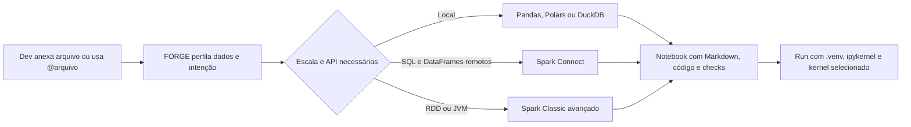

# Jupyter e Spark no FORGE

## Objetivo

Entregar uma experiência notebook-first profissional, reproduzível e com baixa fricção, sem confundir
um cliente Spark Connect com um runtime Spark clássico. O FORGE deve documentar a análise em células,
preparar o ambiente local e escolher a API distribuída mais adequada ao problema.

## Experiência atual

1. `/notebook` ou `FORGE: Preparar kernel Jupyter do projeto` cria/reutiliza `.venv`.
2. O FORGE instala `ipykernel` no ambiente do projeto, nunca no Python global.
3. O interpretador é gravado em `python.defaultInterpreterPath`.
4. As extensões oficiais Python e Jupyter são verificadas e o seletor de kernel é aberto.
5. A edição de `.ipynb` preserva o documento e propõe células Markdown ou código com linguagem, tags e ID.
6. O Run faz preflight do kernel e oferece preparação antes da primeira execução.

## Duas trilhas Spark

| Trilha | Quando usar | APIs | Runtime |
|---|---|---|---|
| Spark Connect | Exploração remota, lakehouse, SQL e DataFrames | `SparkSession.remote`, Spark SQL, DataFrame | Cliente Python leve; servidor Spark remoto |
| Spark Classic avançado | RDD, `SparkContext`, pair RDD, particionador customizado, JVM ou legado | Spark SQL, DataFrame, RDD | PySpark clássico com JVM e cluster/local configurado |

Regras de roteamento:

- Spark Connect é o padrão para análise distribuída interativa.
- RDD nunca é gerado para uma sessão Connect.
- A trilha clássica começa em Spark SQL/DataFrames, exige justificativa para o trecho RDD e volta a um
  DataFrame com schema explícito assim que possível.
- Pandas, Polars, DuckDB ou Ibis continuam preferíveis quando os dados cabem confortavelmente em uma máquina.

## Arquitetura alvo

## Próximos incrementos

### Runtime Pack offline

- Distribuir wheels aprovados de `ipykernel`, Jupyter e dependências por plataforma e versão de Python.
- Oferecer o cliente `pyspark-client` para Spark Connect sem instalar JRE.
- Manter o Spark clássico como pack separado e maior, com JRE homologada e matriz Spark/Python/Java.
- Verificar hashes e origem de todos os artefatos, com inventário/SBOM e atualização administrada.

### Notebook profissional

- Templates de EDA, qualidade, experimento, Spark Connect e Spark Classic SQL + RDD.
- Parâmetros, tags operacionais, execução seletiva, limpeza de outputs e exportação para job modular.
- Captura estruturada de duração, erro, volume retornado e evidência de validação por célula.
- Promoção de funções estáveis do notebook para módulos testados sem perder a narrativa analítica.

### Governança e observabilidade

- Limite explícito para `collect`, `toPandas`, preview e outputs ricos.
- Redação de segredos/PII também na saída da célula antes de anexá-la ao chat.
- Registro do runtime, versões, endpoint lógico, plano Spark e custos/métricas disponíveis.
- Quality gates distintos para Connect e Classic, impedindo APIs incompatíveis antes da execução.
